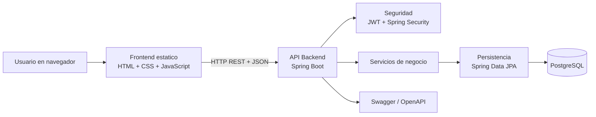
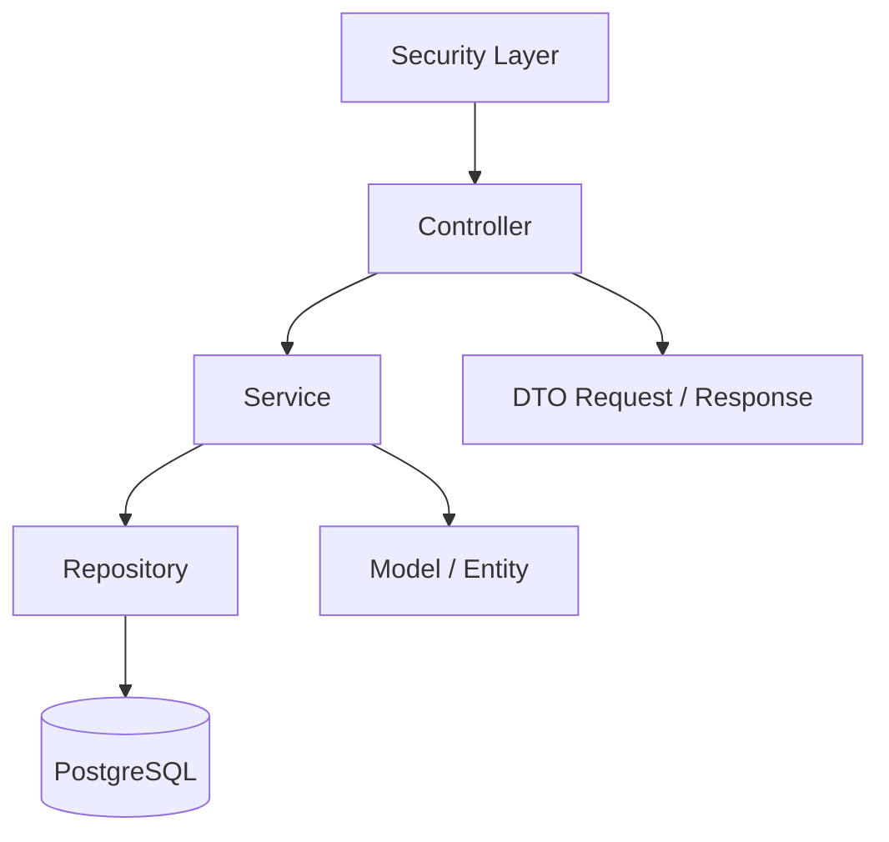

# Arquitectura del Proyecto: Sistema de Inventario

## 1. Objetivo del sistema

El proyecto implementa un sistema web de inventario orientado a la gestion de productos, categorias, movimientos de entrada y salida, usuarios y reportes operativos. Su objetivo es centralizar el control del inventario, mantener trazabilidad sobre cada movimiento realizado y restringir operaciones sensibles por rol.

La solucion esta dividida en dos grandes bloques:

- Un frontend web desacoplado, construido con HTML, CSS y JavaScript modular.
- Un backend REST desarrollado con Spring Boot, encargado de la logica de negocio, seguridad, persistencia y exposicion de datos.

---

## 2. Vision general de la arquitectura

La arquitectura sigue un modelo cliente-servidor desacoplado:



### Idea clave para explicar en una exposicion

El frontend no accede directamente a la base de datos. Todo pasa por una API REST segura. Esto permite separar responsabilidades, proteger la informacion y mantener una estructura escalable.

---

## 3. Stack tecnologico y para que se usa

| Tecnologia | Uso dentro del proyecto |
| --- | --- |
| HTML | Estructura de las vistas del sistema |
| CSS | Estilos visuales de la interfaz |
| JavaScript modular | Logica del cliente, consumo de API, renderizado dinamico |
| Spring Boot 3.5.11 | Framework principal del backend |
| Spring Web | Exposicion de endpoints REST |
| Spring Data JPA | Acceso a datos y mapeo ORM |
| Spring Security | Control de autenticacion y autorizacion |
| JWT | Autenticacion sin estado entre frontend y backend |
| PostgreSQL | Base de datos relacional principal |
| Lombok | Reduccion de codigo repetitivo en Java |
| Swagger / OpenAPI | Documentacion interactiva de la API |
| Docker / Docker Compose | Empaquetado y ejecucion de frontend y backend |
| Maven | Gestion de dependencias y construccion del backend |

---

## 4. Estructura general del proyecto

```text
Sistema-de-Inventario-
|- frontend/
|  |- *.html
|  |- css/
|  |- js/
|     |- core/
|     |- components/
|     |- modules/
|     |- services/
|- SistemaInventario/
|  |- src/main/java/.../
|  |  |- config/
|  |  |- controller/
|  |  |- dto/
|  |  |- exception/
|  |  |- model/
|  |  |- repository/
|  |  |- security/
|  |  |- service/
|  |- src/main/resources/application.properties
|- docker-compose.yml
|- dockerfile
|- docs/
```

### Como leer esta estructura en una presentacion

- `frontend/`: contiene la interfaz de usuario.
- `SistemaInventario/`: contiene toda la logica del servidor.
- `docs/`: documentacion de apoyo.
- `docker-compose.yml`: define como levantar los servicios del sistema.

---

## 5. Arquitectura del frontend

El frontend esta construido como una aplicacion web multipagina, donde cada modulo funcional tiene su propia vista HTML y su logica JavaScript asociada.

### 5.1 Paginas principales

- `login.html`: autenticacion del usuario.
- `index.html`: dashboard principal.
- `productos.html`: gestion de productos.
- `categorias.html`: gestion de categorias.
- `movimientos.html`: registro y consulta de movimientos.
- `usuarios.html`: administracion de usuarios.
- `reportes.html`: reportes y exportacion de datos.

### 5.2 Capas del frontend

#### a) `js/core/`

Contiene funciones base del sistema:

- `api.js`: centraliza las peticiones HTTP al backend.
- `auth.js`: guarda y recupera la sesion JWT desde `localStorage`.
- `router.js`: protege paginas segun autenticacion o rol.
- `utils.js`: funciones auxiliares de formateo y apoyo.

#### b) `js/components/`

Son piezas reutilizables de interfaz:

- barra de navegacion,
- tablas,
- loaders,
- modales,
- toasts,
- estados vacios.

Esto evita repetir codigo visual en cada modulo.

#### c) `js/services/`

Representa la capa de acceso a datos desde el frontend.

Cada archivo encapsula llamadas a endpoints concretos del backend, por ejemplo:

- `producto.service.js`
- `categoria.service.js`
- `movimiento.service.js`
- `usuario.service.js`
- `auth.service.js`

La ventaja es que la vista no conoce los detalles HTTP; solo invoca funciones de servicio.

#### d) `js/modules/`

Aqui vive la logica funcional por pantalla. Cada modulo:

- valida acceso,
- carga datos,
- escucha eventos,
- renderiza tablas o formularios,
- llama a la capa `services/`.

### 5.3 Flujo del frontend

1. El usuario entra a una pagina.
2. El modulo correspondiente verifica autenticacion.
3. Si hay token, el frontend llama al backend.
4. El backend responde JSON.
5. La vista renderiza tablas, metricas, formularios o alertas.

### 5.4 Manejo de autenticacion en cliente

El frontend guarda la sesion en `localStorage` con:

- token JWT,
- email,
- rol,
- tiempo de expiracion.

En cada solicitud, `api.js` agrega el encabezado `Authorization: Bearer <token>`. Si el backend responde `401`, la sesion se limpia y el usuario vuelve al login.

### 5.5 Fortalezas del frontend

- Separacion clara entre UI, servicios y logica de pantalla.
- Componentes reutilizables.
- Navegacion protegida por rol.
- Reportes exportables a CSV.
- Dashboard con indicadores y alertas de stock bajo.

---

## 6. Arquitectura del backend

El backend sigue una arquitectura por capas, muy comun en aplicaciones empresariales con Spring Boot.



### 6.1 `config/`

Contiene configuraciones generales del sistema:

- `SecurityConfig`: define seguridad stateless con JWT, CORS y filtros.
- `OpenApiConfig`: configura la documentacion de la API.
- `DataInitializer`: prepara roles base y puede crear un usuario administrador inicial.

### 6.2 `controller/`

Expone los endpoints REST que consume el frontend:

- `AuthController`
- `ProductoController`
- `CategoriaController`
- `MovimientoController`
- `UsuarioController`

El controller recibe la solicitud, valida el request y delega la logica al servicio correspondiente.

### 6.3 `service/`

Es la capa mas importante de negocio. Aqui se resuelven las reglas funcionales.

Ejemplos:

- `AuthService`: registro y login.
- `ProductoService`: CRUD de productos y consulta de stock bajo.
- `MovimientoService`: registra entradas y salidas y actualiza stock.
- `UsuarioService`: administracion de usuarios, cambio de password y desactivacion.
- `CategoriaService`: CRUD de categorias.

### 6.4 `repository/`

Usa Spring Data JPA para acceder a la base de datos. Su funcion es persistir y consultar entidades sin tener que escribir SQL manual en la mayoria de los casos.

### 6.5 `model/`

Representa las entidades del dominio:

- `Usuario`
- `Rol`
- `Categoria`
- `Producto`
- `MovimientoInventario`

### 6.6 `dto/`

Se usan DTOs de entrada y salida para no exponer directamente las entidades. Esto mejora:

- seguridad,
- control de validaciones,
- claridad contractual de la API,
- desacoplamiento entre base de datos y respuestas JSON.

### 6.7 `security/`

Implementa:

- generacion y validacion de tokens JWT,
- filtro de autenticacion por request,
- integracion con `UserDetailsService`,
- control de permisos por rol.

### 6.8 `exception/`

Centraliza errores de negocio como:

- recurso no encontrado,
- email duplicado,
- stock insuficiente,
- reglas de negocio invalidas.

---

## 7. Modelo de dominio y relaciones

El sistema esta basado en cinco entidades principales:

### 7.1 Usuario

Representa a la persona que accede al sistema.

Datos importantes:

- nombre,
- email,
- password cifrada,
- estado activo/inactivo,
- rol,
- fecha de creacion.

Ademas, `Usuario` implementa `UserDetails`, lo que permite integrarlo directamente con Spring Security.

### 7.2 Rol

Define el nivel de acceso. Los roles principales son:

- `ADMIN`
- `EMPLEADO`

Esto permite diferenciar operaciones de consulta y operaciones administrativas.

### 7.3 Categoria

Agrupa productos por clasificacion. Una categoria puede tener muchos productos.

### 7.4 Producto

Es la entidad central del inventario.

Campos clave:

- nombre,
- descripcion,
- precio,
- stock actual,
- stock minimo,
- categoria,
- fechas de creacion y actualizacion.

Tambien incorpora logica para detectar si un producto esta en stock bajo.

### 7.5 MovimientoInventario

Registra cada entrada o salida de inventario.

Contiene:

- tipo de movimiento,
- cantidad,
- fecha,
- observacion,
- producto asociado,
- usuario que realizo la accion.

### 7.6 Relaciones principales

- Un `Rol` puede estar asociado a muchos `Usuario`.
- Una `Categoria` puede tener muchos `Producto`.
- Un `Producto` puede tener muchos `MovimientoInventario`.
- Un `Usuario` puede registrar muchos `MovimientoInventario`.

### Idea fuerte para exponer

Cada movimiento deja trazabilidad completa: que producto se movio, quien lo hizo, cuando lo hizo y en que cantidad. Esa trazabilidad es uno de los puntos mas importantes del sistema.

---

## 8. Seguridad del sistema

La seguridad esta basada en Spring Security + JWT.

### 8.1 Como funciona

1. El usuario hace login con email y password.
2. El backend autentica con `AuthenticationManager`.
3. Si las credenciales son validas, genera un token JWT.
4. El frontend guarda el token y lo envia en cada peticion.
5. Un filtro JWT valida el token antes de permitir acceso a los endpoints protegidos.

### 8.2 Caracteristicas principales

- Arquitectura stateless: el servidor no guarda sesion en memoria.
- Passwords cifradas con BCrypt.
- Endpoints publicos solo para autenticacion y Swagger.
- Restricciones por rol con `@PreAuthorize`.

### 8.3 Ejemplos de control de acceso

- Cualquier usuario autenticado puede consultar informacion operativa.
- Solo `ADMIN` puede crear, editar o eliminar productos, categorias y usuarios.
- La gestion de usuarios esta completamente protegida a nivel de controller.

---

## 9. Flujo funcional de los modulos

### 9.1 Login

- El usuario entra por `login.html`.
- El frontend envia credenciales a `/api/auth/login`.
- El backend responde con token, rol y tiempo de expiracion.
- El frontend guarda la sesion y redirige al dashboard.

### 9.2 Dashboard

- Consume productos, categorias, movimientos y alertas de stock bajo.
- Muestra KPIs de inventario y movimientos recientes.
- Advierte cuando existen productos por debajo del stock minimo.

### 9.3 Productos

- Permite listar, crear, editar y eliminar productos.
- Cada producto pertenece a una categoria.
- El stock minimo se usa para generar alertas operativas.

### 9.4 Categorias

- Permite mantener la clasificacion de productos.
- Facilita orden y filtrado en catalogo y reportes.

### 9.5 Movimientos

Es uno de los modulos mas relevantes del proyecto.

Proceso:

1. El usuario selecciona un producto.
2. Define si es `ENTRADA` o `SALIDA`.
3. Ingresa cantidad y observacion.
4. El backend valida disponibilidad si es una salida.
5. El stock del producto se actualiza.
6. Se registra un movimiento historico con usuario y fecha.

Este modulo garantiza consistencia operativa porque no solo guarda el evento, sino que impacta el stock real del producto.

### 9.6 Usuarios

- Solo visible y operable por administradores.
- Permite crear usuarios, editar datos, cambiar password y desactivar cuentas.
- El estado `activo` tambien impacta en la capacidad de autenticarse.

### 9.7 Reportes

El frontend construye reportes a partir de la informacion obtenida de la API:

- inventario,
- movimientos,
- productos con stock bajo,
- usuarios, cuando el rol es administrador.

Ademas permite exportacion CSV para uso operativo.

---

## 10. API REST disponible

### Autenticacion

- `POST /api/auth/login`
- `POST /api/auth/register`

### Productos

- `GET /api/productos`
- `GET /api/productos/{id}`
- `GET /api/productos/stock-bajo`
- `POST /api/productos`
- `PUT /api/productos/{id}`
- `DELETE /api/productos/{id}`

### Categorias

- `GET /api/categorias`
- `GET /api/categorias/{id}`
- `POST /api/categorias`
- `PUT /api/categorias/{id}`
- `DELETE /api/categorias/{id}`

### Movimientos

- `GET /api/movimientos`
- `GET /api/movimientos/producto/{id}`
- `POST /api/movimientos`

### Usuarios

- `GET /api/usuarios`
- `GET /api/usuarios/{id}`
- `POST /api/usuarios`
- `PUT /api/usuarios/{id}`
- `PUT /api/usuarios/{id}/password`
- `DELETE /api/usuarios/{id}`

### Documentacion interactiva

La API puede consultarse desde Swagger UI, lo que facilita pruebas, validacion y explicacion tecnica durante una demo.

---

## 11. Persistencia y base de datos

La aplicacion utiliza PostgreSQL como base de datos relacional principal.

### Configuracion importante

- Base esperada: `sistema_inventario`
- Puerto configurado por defecto: `7000`
- Usuario por defecto: `postgres`
- Password por defecto: `Admin`

### Propiedades relevantes

- `spring.jpa.hibernate.ddl-auto=update`
- `spring.jpa.show-sql=true`

### Que significa esto en una exposicion

- `ddl-auto=update` permite que Hibernate ajuste el esquema sin eliminar datos existentes.
- PostgreSQL aporta integridad relacional y soporte robusto para una aplicacion empresarial.

---

## 12. Despliegue y ejecucion

El proyecto soporta ejecucion local y mediante contenedores.

### 12.1 Backend

Se construye con Maven y Java 17.

### 12.2 Frontend

Se sirve como contenido estatico en un contenedor independiente.

### 12.3 Docker Compose

`docker-compose.yml` levanta dos servicios:

- `backend` en el puerto `8080`
- `frontend` en el puerto `8081`

### 12.4 Conexion a base de datos

El backend espera conectarse a una base PostgreSQL existente. En Docker, se usa `host.docker.internal` para llegar a la base alojada en la maquina host.

### 12.5 Variables de entorno clave

- `DB_URL`
- `DB_USERNAME`
- `DB_PASSWORD`
- `JWT_SECRET`
- `JWT_EXPIRATION_MS`
- `APP_SEED_ADMIN`
- `APP_SEED_ADMIN_EMAIL`
- `APP_SEED_ADMIN_PASSWORD`
- `APP_SEED_ADMIN_NOMBRE`

### 12.6 Usuario inicial de administracion

Si el seed esta activo, el sistema puede crear o actualizar automaticamente un usuario administrador inicial.

Credenciales usuales de trabajo:

- Email: `admin@inventario.com`
- Password: `Admin123`

---

## 13. Como usar el sistema

### Perfil administrador

Puede:

- iniciar sesion,
- gestionar productos,
- gestionar categorias,
- registrar movimientos,
- gestionar usuarios,
- consultar reportes.

### Perfil empleado

Puede:

- iniciar sesion,
- consultar dashboard,
- consultar productos y categorias,
- registrar movimientos,
- consultar reportes operativos.

### Secuencia operativa recomendada

1. Crear categorias.
2. Registrar productos.
3. Registrar movimientos de entrada para inicializar stock.
4. Registrar salidas conforme se use el inventario.
5. Revisar dashboard y reportes para detectar alertas.

---

## 14. Puntos fuertes de la solucion

1. Separacion clara entre frontend y backend.
2. Seguridad moderna con JWT y Spring Security.
3. Modelo de capas ordenado y facil de mantener.
4. Trazabilidad completa de movimientos de inventario.
5. Control de acceso por roles.
6. Dashboard y reportes utiles para operacion diaria.
7. Despliegue portable con Docker.
8. API documentada con Swagger.

---

## 15. Posibles mejoras futuras

Estas ideas pueden mencionarse al final de la exposicion como evolucion del proyecto:

1. Agregar auditoria mas detallada por entidad.
2. Implementar reportes graficos con librerias de visualizacion.
3. Incorporar paginacion y filtros avanzados en backend.
4. Registrar bitacora de acciones administrativas.
5. Agregar recuperacion de contraseña.
6. Crear pruebas unitarias e integracion mas amplias por modulo.
7. Incorporar despliegue cloud automatizado.

---

## 16. Guion sugerido para la exposicion

### Apertura

"Este proyecto es un sistema web de inventario que permite controlar productos, categorias, movimientos, usuarios y reportes, con autenticacion segura y arquitectura desacoplada entre cliente y servidor."

### Parte 1: problema que resuelve

"La necesidad principal es llevar control del inventario de forma centralizada, saber que entra, que sale, quien lo registra y detectar rapidamente productos con stock bajo."

### Parte 2: arquitectura

"La solucion se divide en frontend y backend. El frontend presenta la interfaz al usuario y consume una API REST. El backend implementa la logica de negocio, seguridad, acceso a datos y comunicacion con PostgreSQL."

### Parte 3: seguridad

"El acceso esta protegido con JWT. El usuario inicia sesion, recibe un token y lo usa en cada peticion. Ademas, el sistema diferencia permisos entre administrador y empleado."

### Parte 4: flujo clave

"El flujo mas importante es el de movimientos: cuando se registra una entrada o salida, el sistema actualiza el stock y guarda la trazabilidad completa del evento."

### Parte 5: valor tecnico

"A nivel tecnico, el proyecto usa una arquitectura por capas, DTOs, control por roles, persistencia con JPA y una separacion clara entre interfaz y negocio. Eso lo hace mantenible y escalable."

### Cierre

"En conjunto, el sistema no solo muestra datos, sino que controla inventario en tiempo real, aplica reglas de negocio y deja preparada una base solida para futuras ampliaciones."

---

## 17. Demo recomendada en vivo

Si vas a exponer el sistema funcionando, esta secuencia es clara y efectiva:

1. Mostrar login.
2. Entrar como administrador.
3. Enseñar dashboard y KPIs.
4. Ir a categorias y mostrar una categoria existente.
5. Ir a productos y mostrar relacion producto-categoria.
6. Registrar una entrada o salida en movimientos.
7. Mostrar como cambia el stock.
8. Ir a reportes y exportar un CSV.
9. Mostrar usuarios y explicar restriccion por rol.

---

## 18. Resumen final

El Sistema de Inventario esta construido con una arquitectura moderna y ordenada:

- frontend desacoplado,
- backend REST con Spring Boot,
- seguridad JWT,
- base de datos PostgreSQL,
- control por roles,
- trazabilidad de movimientos,
- despliegue con Docker.

Desde el punto de vista academico y profesional, el proyecto demuestra integracion entre interfaz, servicios, seguridad, persistencia y despliegue, con un caso de negocio claro y facil de defender en una exposicion.