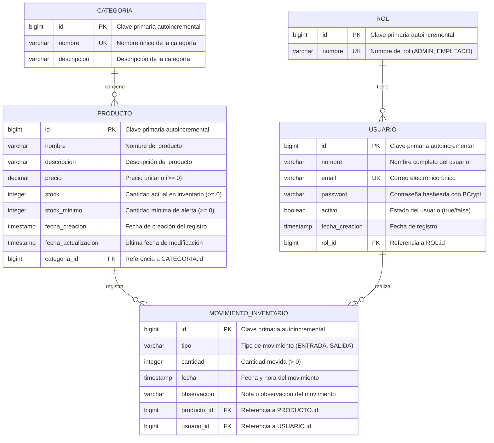

# Diagrama Entidad-Relación (ER) — Sistema de Inventario

## Descripción General

Este documento describe el modelo entidad-relación del Sistema de Inventario Web. El modelo define las entidades del sistema, sus atributos, claves primarias, claves foráneas y las relaciones entre ellas.

---

## Diagrama ER (Mermaid)



---

## Descripción Detallada de Entidades

### 1. ROL

Almacena los roles disponibles en el sistema.

| Atributo | Tipo         | Restricciones          | Descripción                      |
|----------|--------------|------------------------|----------------------------------|
| id       | BIGINT       | PK, AUTO_INCREMENT     | Identificador único del rol      |
| nombre   | VARCHAR(50)  | UNIQUE, NOT NULL       | Nombre del rol (ADMIN, EMPLEADO) |

**Valores iniciales:**
- `ADMIN` — Acceso total al sistema
- `EMPLEADO` — Acceso limitado (consultas y movimientos)

---

### 2. USUARIO

Almacena los usuarios registrados en el sistema.

| Atributo       | Tipo          | Restricciones              | Descripción                                |
|----------------|---------------|----------------------------|--------------------------------------------|
| id             | BIGINT        | PK, AUTO_INCREMENT         | Identificador único del usuario            |
| nombre         | VARCHAR(100)  | NOT NULL                   | Nombre completo                            |
| email          | VARCHAR(150)  | UNIQUE, NOT NULL           | Correo electrónico (usado para login)      |
| password       | VARCHAR(255)  | NOT NULL                   | Contraseña almacenada con hash BCrypt      |
| activo         | BOOLEAN       | NOT NULL, DEFAULT true     | Indica si el usuario está activo           |
| fecha_creacion | TIMESTAMP     | NOT NULL, DEFAULT NOW()    | Fecha y hora de creación del registro      |
| rol_id         | BIGINT        | FK → ROL(id), NOT NULL     | Rol asignado al usuario                    |

**Relaciones:**
- Cada usuario pertenece a **un** rol (N:1 con ROL)
- Un usuario puede realizar **muchos** movimientos (1:N con MOVIMIENTO_INVENTARIO)

---

### 3. CATEGORIA

Almacena las categorías para clasificar los productos.

| Atributo    | Tipo          | Restricciones          | Descripción                        |
|-------------|---------------|------------------------|------------------------------------|
| id          | BIGINT        | PK, AUTO_INCREMENT     | Identificador único de la categoría|
| nombre      | VARCHAR(100)  | UNIQUE, NOT NULL       | Nombre de la categoría             |
| descripcion | VARCHAR(255)  | NULLABLE               | Descripción opcional               |

**Relaciones:**
- Una categoría puede tener **muchos** productos (1:N con PRODUCTO)

---

### 4. PRODUCTO

Almacena los productos del inventario.

| Atributo            | Tipo          | Restricciones              | Descripción                              |
|---------------------|---------------|----------------------------|------------------------------------------|
| id                  | BIGINT        | PK, AUTO_INCREMENT         | Identificador único del producto         |
| nombre              | VARCHAR(150)  | NOT NULL                   | Nombre del producto                      |
| descripcion         | VARCHAR(500)  | NULLABLE                   | Descripción detallada del producto       |
| precio              | DECIMAL(10,2) | NOT NULL, CHECK (>= 0)     | Precio unitario del producto             |
| stock               | INTEGER       | NOT NULL, DEFAULT 0, CHECK (>= 0) | Cantidad actual en inventario   |
| stock_minimo        | INTEGER       | NOT NULL, DEFAULT 0, CHECK (>= 0) | Umbral mínimo para alertas      |
| fecha_creacion      | TIMESTAMP     | NOT NULL, DEFAULT NOW()    | Fecha de creación del registro           |
| fecha_actualizacion | TIMESTAMP     | NULLABLE                   | Última fecha de modificación             |
| categoria_id        | BIGINT        | FK → CATEGORIA(id), NOT NULL | Categoría a la que pertenece           |

**Relaciones:**
- Cada producto pertenece a **una** categoría (N:1 con CATEGORIA)
- Un producto puede tener **muchos** movimientos (1:N con MOVIMIENTO_INVENTARIO)

**Regla de negocio:**
- Cuando `stock <= stock_minimo`, el sistema genera una alerta de stock bajo

---

### 5. MOVIMIENTO_INVENTARIO

Registra todas las entradas y salidas de productos.

| Atributo    | Tipo          | Restricciones                  | Descripción                               |
|-------------|---------------|--------------------------------|-------------------------------------------|
| id          | BIGINT        | PK, AUTO_INCREMENT             | Identificador único del movimiento        |
| tipo        | VARCHAR(10)   | NOT NULL, CHECK (ENTRADA/SALIDA) | Tipo de movimiento                      |
| cantidad    | INTEGER       | NOT NULL, CHECK (> 0)          | Cantidad de unidades movidas              |
| fecha       | TIMESTAMP     | NOT NULL, DEFAULT NOW()        | Fecha y hora del movimiento               |
| observacion | VARCHAR(500)  | NULLABLE                       | Nota descriptiva del movimiento           |
| producto_id | BIGINT        | FK → PRODUCTO(id), NOT NULL    | Producto afectado                         |
| usuario_id  | BIGINT        | FK → USUARIO(id), NOT NULL     | Usuario que realizó el movimiento         |

**Relaciones:**
- Cada movimiento afecta a **un** producto (N:1 con PRODUCTO)
- Cada movimiento es realizado por **un** usuario (N:1 con USUARIO)

**Reglas de negocio:**
- Al registrar una ENTRADA, se suma `cantidad` al `stock` del producto
- Al registrar una SALIDA, se resta `cantidad` del `stock` del producto
- No se permite una SALIDA si `cantidad > stock` actual del producto

---

## Relaciones y Cardinalidades

| Relación                            | Cardinalidad | Descripción                                             |
|-------------------------------------|--------------|---------------------------------------------------------|
| ROL → USUARIO                       | 1:N          | Un rol puede ser asignado a muchos usuarios             |
| USUARIO → MOVIMIENTO_INVENTARIO     | 1:N          | Un usuario puede realizar muchos movimientos            |
| CATEGORIA → PRODUCTO                | 1:N          | Una categoría puede contener muchos productos           |
| PRODUCTO → MOVIMIENTO_INVENTARIO    | 1:N          | Un producto puede tener muchos movimientos registrados  |

---

## Script SQL de Creación de Tablas

```sql
-- Creación de la base de datos
-- CREATE DATABASE sistema_inventario_db;

-- Tabla ROL
CREATE TABLE rol (
    id BIGSERIAL PRIMARY KEY,
    nombre VARCHAR(50) NOT NULL UNIQUE
);

-- Tabla USUARIO
CREATE TABLE usuario (
    id BIGSERIAL PRIMARY KEY,
    nombre VARCHAR(100) NOT NULL,
    email VARCHAR(150) NOT NULL UNIQUE,
    password VARCHAR(255) NOT NULL,
    activo BOOLEAN NOT NULL DEFAULT TRUE,
    fecha_creacion TIMESTAMP NOT NULL DEFAULT NOW(),
    rol_id BIGINT NOT NULL,
    CONSTRAINT fk_usuario_rol FOREIGN KEY (rol_id) REFERENCES rol(id)
);

-- Tabla CATEGORIA
CREATE TABLE categoria (
    id BIGSERIAL PRIMARY KEY,
    nombre VARCHAR(100) NOT NULL UNIQUE,
    descripcion VARCHAR(255)
);

-- Tabla PRODUCTO
CREATE TABLE producto (
    id BIGSERIAL PRIMARY KEY,
    nombre VARCHAR(150) NOT NULL,
    descripcion VARCHAR(500),
    precio DECIMAL(10, 2) NOT NULL CHECK (precio >= 0),
    stock INTEGER NOT NULL DEFAULT 0 CHECK (stock >= 0),
    stock_minimo INTEGER NOT NULL DEFAULT 0 CHECK (stock_minimo >= 0),
    fecha_creacion TIMESTAMP NOT NULL DEFAULT NOW(),
    fecha_actualizacion TIMESTAMP,
    categoria_id BIGINT NOT NULL,
    CONSTRAINT fk_producto_categoria FOREIGN KEY (categoria_id) REFERENCES categoria(id)
);

-- Tabla MOVIMIENTO_INVENTARIO
CREATE TABLE movimiento_inventario (
    id BIGSERIAL PRIMARY KEY,
    tipo VARCHAR(10) NOT NULL CHECK (tipo IN ('ENTRADA', 'SALIDA')),
    cantidad INTEGER NOT NULL CHECK (cantidad > 0),
    fecha TIMESTAMP NOT NULL DEFAULT NOW(),
    observacion VARCHAR(500),
    producto_id BIGINT NOT NULL,
    usuario_id BIGINT NOT NULL,
    CONSTRAINT fk_movimiento_producto FOREIGN KEY (producto_id) REFERENCES producto(id),
    CONSTRAINT fk_movimiento_usuario FOREIGN KEY (usuario_id) REFERENCES usuario(id)
);

-- Datos iniciales de roles
INSERT INTO rol (nombre) VALUES ('ADMIN');
INSERT INTO rol (nombre) VALUES ('EMPLEADO');

-- Índices para optimización
CREATE INDEX idx_producto_categoria ON producto(categoria_id);
CREATE INDEX idx_producto_stock ON producto(stock, stock_minimo);
CREATE INDEX idx_movimiento_producto ON movimiento_inventario(producto_id);
CREATE INDEX idx_movimiento_usuario ON movimiento_inventario(usuario_id);
CREATE INDEX idx_movimiento_fecha ON movimiento_inventario(fecha);
CREATE INDEX idx_usuario_email ON usuario(email);
```

---

## Notas

- Todas las claves primarias utilizan `BIGSERIAL` (autoincremental de 64 bits) para escalabilidad.
- Los tipos `TIMESTAMP` incluyen fecha y hora para trazabilidad completa.
- El campo `tipo` en `MOVIMIENTO_INVENTARIO` usa un CHECK constraint en lugar de un ENUM para mayor portabilidad.
- Los índices se crean sobre las columnas más consultadas y las claves foráneas para optimizar el rendimiento de las consultas.
