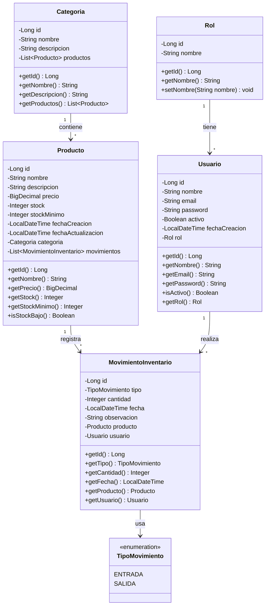
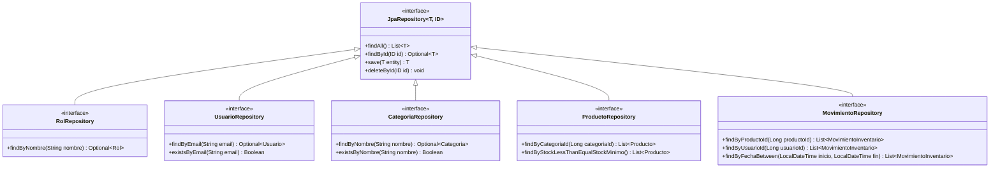
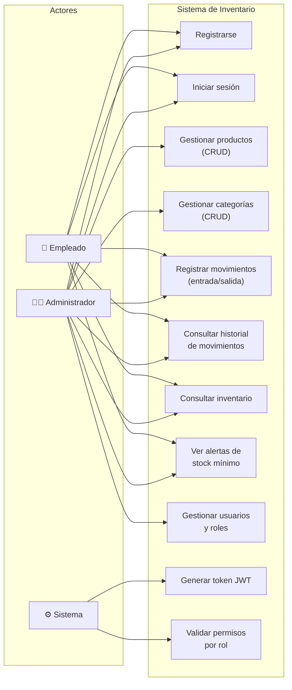
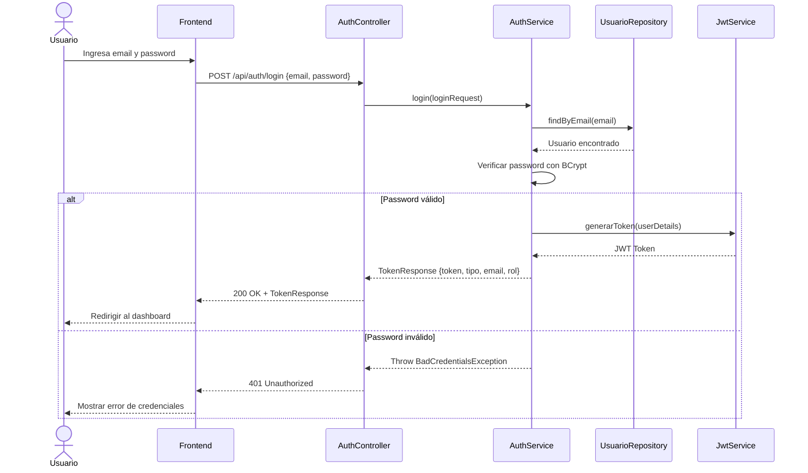
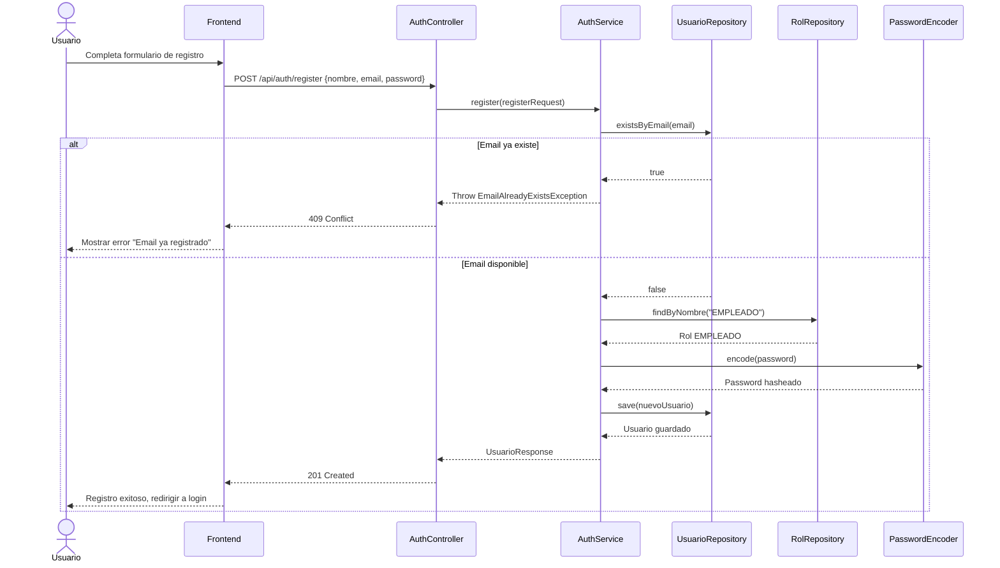
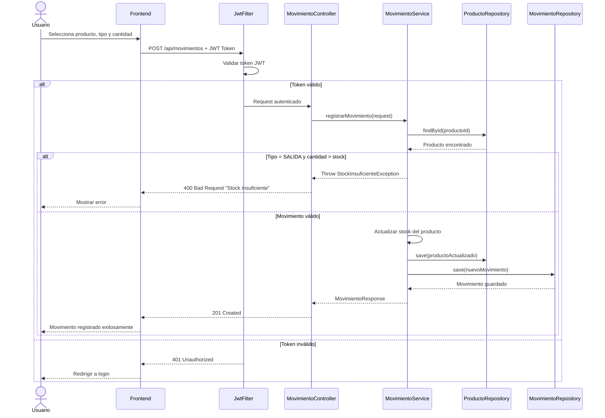
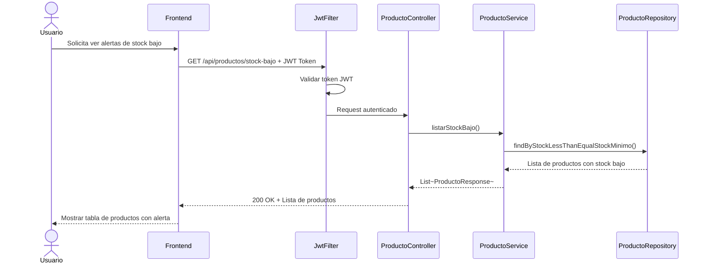
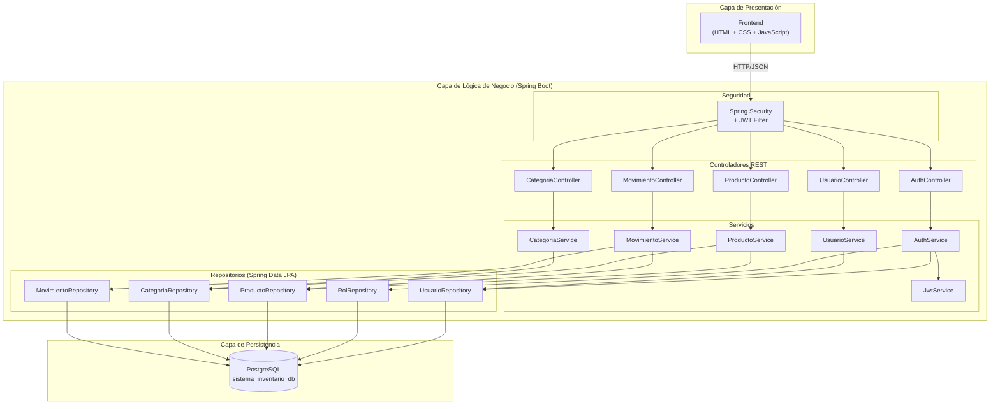
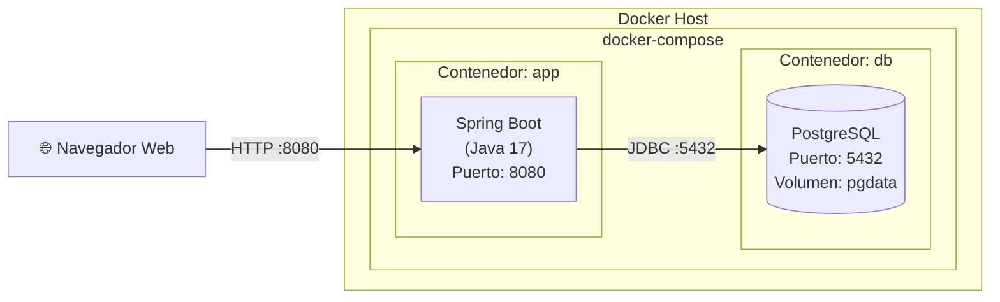

# Diagrama UML — Sistema de Inventario

## Descripción General

Este documento contiene los diagramas UML del Sistema de Inventario Web, incluyendo:

1. **Diagrama de clases** — Estructura de las entidades y sus relaciones
2. **Diagrama de casos de uso** — Interacciones de los actores con el sistema
3. **Diagrama de secuencia** — Flujos principales del sistema

Todos los diagramas están en formato **Mermaid** para renderizado directo en editores compatibles (VS Code, GitHub, etc.).

---

## 1. Diagrama de Clases



---

## 2. Diagrama de Clases — Capa de Servicio y Controladores

```mermaid
classDiagram
    class AuthController {
        -AuthService authService
        +login(LoginRequest) ResponseEntity~TokenResponse~
        +register(RegisterRequest) ResponseEntity~UsuarioResponse~
    }

    class ProductoController {
        -ProductoService productoService
        +listarTodos() ResponseEntity~List~
        +obtenerPorId(Long id) ResponseEntity~ProductoResponse~
        +crear(ProductoRequest) ResponseEntity~ProductoResponse~
        +actualizar(Long id, ProductoRequest) ResponseEntity~ProductoResponse~
        +eliminar(Long id) ResponseEntity~Void~
        +listarStockBajo() ResponseEntity~List~
    }

    class CategoriaController {
        -CategoriaService categoriaService
        +listarTodas() ResponseEntity~List~
        +obtenerPorId(Long id) ResponseEntity~CategoriaResponse~
        +crear(CategoriaRequest) ResponseEntity~CategoriaResponse~
        +actualizar(Long id, CategoriaRequest) ResponseEntity~CategoriaResponse~
        +eliminar(Long id) ResponseEntity~Void~
    }

    class MovimientoController {
        -MovimientoService movimientoService
        +registrarMovimiento(MovimientoRequest) ResponseEntity~MovimientoResponse~
        +listarTodos() ResponseEntity~List~
        +listarPorProducto(Long productoId) ResponseEntity~List~
    }

    class UsuarioController {
        -UsuarioService usuarioService
        +listarTodos() ResponseEntity~List~
        +obtenerPorId(Long id) ResponseEntity~UsuarioResponse~
        +actualizar(Long id, UsuarioUpdateRequest) ResponseEntity~UsuarioResponse~
        +desactivar(Long id) ResponseEntity~Void~
    }

    class AuthService {
        -UsuarioRepository usuarioRepository
        -RolRepository rolRepository
        -PasswordEncoder passwordEncoder
        -JwtService jwtService
        +login(LoginRequest) TokenResponse
        +register(RegisterRequest) UsuarioResponse
    }

    class ProductoService {
        -ProductoRepository productoRepository
        -CategoriaRepository categoriaRepository
        +listarTodos() List~ProductoResponse~
        +obtenerPorId(Long id) ProductoResponse
        +crear(ProductoRequest) ProductoResponse
        +actualizar(Long id, ProductoRequest) ProductoResponse
        +eliminar(Long id) void
        +listarStockBajo() List~ProductoResponse~
    }

    class CategoriaService {
        -CategoriaRepository categoriaRepository
        +listarTodas() List~CategoriaResponse~
        +obtenerPorId(Long id) CategoriaResponse
        +crear(CategoriaRequest) CategoriaResponse
        +actualizar(Long id, CategoriaRequest) CategoriaResponse
        +eliminar(Long id) void
    }

    class MovimientoService {
        -MovimientoRepository movimientoRepository
        -ProductoRepository productoRepository
        +registrarMovimiento(MovimientoRequest) MovimientoResponse
        +listarTodos() List~MovimientoResponse~
        +listarPorProducto(Long productoId) List~MovimientoResponse~
    }

    class UsuarioService {
        -UsuarioRepository usuarioRepository
        +listarTodos() List~UsuarioResponse~
        +obtenerPorId(Long id) UsuarioResponse
        +actualizar(Long id, UsuarioUpdateRequest) UsuarioResponse
        +desactivar(Long id) void
    }

    class JwtService {
        -String secretKey
        -Long expiration
        +generarToken(UserDetails) String
        +validarToken(String token) Boolean
        +extraerEmail(String token) String
    }

    AuthController --> AuthService
    ProductoController --> ProductoService
    CategoriaController --> CategoriaService
    MovimientoController --> MovimientoService
    UsuarioController --> UsuarioService
    AuthService --> JwtService
```



---

## 3. Diagrama de Clases — Capa de Repositorios



---

## 4. Diagrama de Casos de Uso



---

## 5. Diagrama de Secuencia — Inicio de Sesión (Login)



---

## 6. Diagrama de Secuencia — Registro de Usuario



---

## 7. Diagrama de Secuencia — Registro de Movimiento de Inventario



---

## 8. Diagrama de Secuencia — Consulta de Productos con Stock Bajo



---

## 9. Diagrama de Componentes — Arquitectura de Tres Capas



---

## 10. Diagrama de Despliegue (Docker)



---

## Estructura de Paquetes del Proyecto

```
EntornosProgramacion.SistemaInventario
├── config/
│   ├── SecurityConfig.java
│   └── CorsConfig.java
├── security/
│   ├── JwtService.java
│   ├── JwtAuthenticationFilter.java
│   └── CustomUserDetailsService.java
├── controller/
│   ├── AuthController.java
│   ├── ProductoController.java
│   ├── CategoriaController.java
│   ├── MovimientoController.java
│   └── UsuarioController.java
├── service/
│   ├── AuthService.java
│   ├── ProductoService.java
│   ├── CategoriaService.java
│   ├── MovimientoService.java
│   └── UsuarioService.java
├── repository/
│   ├── RolRepository.java
│   ├── UsuarioRepository.java
│   ├── ProductoRepository.java
│   ├── CategoriaRepository.java
│   └── MovimientoRepository.java
├── model/
│   ├── Rol.java
│   ├── Usuario.java
│   ├── Producto.java
│   ├── Categoria.java
│   ├── MovimientoInventario.java
│   └── TipoMovimiento.java (enum)
├── dto/
│   ├── request/
│   │   ├── LoginRequest.java
│   │   ├── RegisterRequest.java
│   │   ├── ProductoRequest.java
│   │   ├── CategoriaRequest.java
│   │   ├── MovimientoRequest.java
│   │   └── UsuarioUpdateRequest.java
│   └── response/
│       ├── TokenResponse.java
│       ├── UsuarioResponse.java
│       ├── ProductoResponse.java
│       ├── CategoriaResponse.java
│       └── MovimientoResponse.java
├── exception/
│   ├── GlobalExceptionHandler.java
│   ├── ResourceNotFoundException.java
│   ├── EmailAlreadyExistsException.java
│   └── StockInsuficienteException.java
└── SistemaInventarioApplication.java
```

---

## Notas

- Los diagramas están en formato **Mermaid**, compatible con GitHub, GitLab, VS Code (con extensión), y herramientas como Notion.
- Para visualizarlos, usa un previsualizador de Markdown que soporte Mermaid o copia el código en [mermaid.live](https://mermaid.live).
- La estructura de paquetes sigue el patrón estándar de Spring Boot: **Controller → Service → Repository → Entity**.
- Los DTOs (Data Transfer Objects) separan la capa de transporte de las entidades JPA para evitar exponer la estructura interna de la base de datos.
