# Explicacion Detallada del Proyecto — Sistema de Inventario Web

**Universidad Industrial de Santander**  
Escuela de Ingenieria de Sistemas e Informatica — Entornos de Programacion F-1

**Fecha:** 2026-05-08  
**Version del documento:** 2.0 (Sprint 2 + Mejoras)

---

## Indice

1. [Que hace el sistema](#1-que-hace-el-sistema)
2. [Casos de uso](#2-casos-de-uso)
3. [Arquitectura general](#3-arquitectura-general)
4. [Capa de Base de Datos](#4-capa-de-base-de-datos)
5. [Capa Backend (Spring Boot)](#5-capa-backend-spring-boot)
6. [Capa Frontend (React + TypeScript)](#6-capa-frontend-react--typescript)
7. [Flujos de negocio completos](#7-flujos-de-negocio-completos)
8. [Despliegue con Docker](#8-despliegue-con-docker)
9. [Decisiones de diseno](#9-decisiones-de-diseno)
10. [Endpoints completos de la API](#10-endpoints-completos-de-la-api)
11. [Capturas del sistema](#11-capturas-del-sistema)

---

## 1. Que hace el sistema

El **Sistema de Inventario Web** es una aplicacion fullstack disenada para comercios pequenos y medianos que necesitan administrar de forma centralizada su catalogo de productos, sus ventas, su efectivo y a sus empleados. Esta construida sobre tres capas independientes que se comunican mediante protocolos estandar (HTTP/REST y JDBC), lo que permite escalar cada una por separado y reemplazar componentes en el futuro sin afectar al resto.

### 1.1 Problema que resuelve

Los comercios pequenos suelen llevar su inventario en hojas de calculo o cuadernos, lo que produce:

- **Errores de stock** porque no hay validacion automatica al registrar una venta.
- **Falta de trazabilidad**: no se sabe quien hizo cada movimiento ni cuando.
- **Cuadre de caja inexacto** porque los totales se calculan a mano al final del turno.
- **Visibilidad nula** sobre cuales son los productos que mas se venden o cuales estan por agotarse.
- **Sin control de acceso**: cualquier persona con el archivo puede modificarlo.

El sistema atiende cada uno de estos puntos con funcionalidades concretas:

| Problema | Funcionalidad |
|----------|---------------|
| Errores de stock | Validacion en cada venta antes de modificar nada (transaccional) |
| Trazabilidad | Tabla `movimiento_inventario` que registra cada cambio con usuario y fecha |
| Cuadre de caja | Modulo de arqueo con monto inicial, ventas en efectivo y cierre con diferencia |
| Visibilidad | Dashboard con KPIs de ventas, top productos y alertas de stock bajo |
| Control de acceso | Roles ADMIN/EMPLEADO con permisos granulares y autenticacion JWT |

### 1.2 Usuarios del sistema

| Rol | Quien es | Que puede hacer |
|-----|----------|-----------------|
| **ADMIN** | Dueno del comercio o gerente | Todo: CRUD de productos, categorias, usuarios, gestion de permisos, ver reportes, anular ventas |
| **EMPLEADO** | Cajero / vendedor | Procesar ventas, registrar movimientos, abrir/cerrar su propio arqueo, ver reportes (configurable) |

---

## 2. Casos de uso

### 2.1 Diagrama general de actores

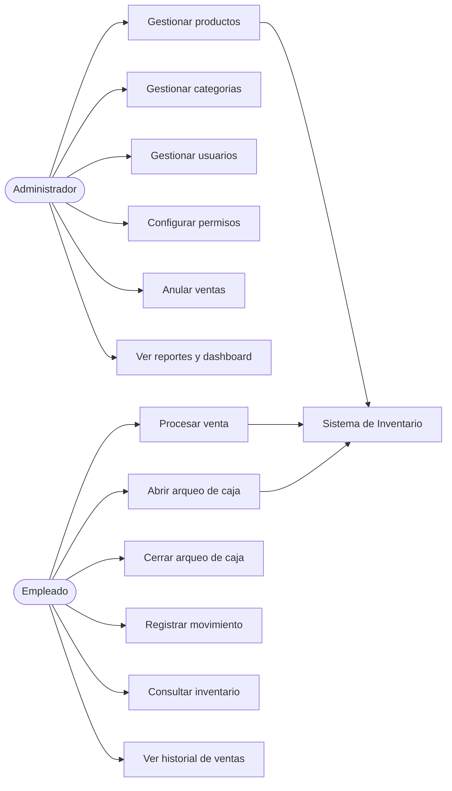

> **[Figura 2.1: Diagrama de actores y casos de uso]**

### 2.2 Caso de uso CU-01 — Procesar venta

| Campo | Detalle |
|-------|---------|
| **ID** | CU-01 |
| **Nombre** | Procesar venta |
| **Actor principal** | Empleado / Administrador (cualquier usuario autenticado) |
| **Precondicion** | El usuario inicio sesion. Existen productos con stock > 0. |
| **Postcondicion exitosa** | Se crea un registro en `venta`, sus correspondientes en `detalle_venta`, se descuenta el stock y se registran los movimientos `SALIDA`. Si hay arqueo abierto y el pago es en efectivo, se actualiza `monto_ventas_efectivo`. |
| **Postcondicion fallida** | Ninguna modificacion se persiste (transaccion revertida). |
| **Flujo principal** | 1. El usuario navega a `/carrito`.<br>2. El sistema muestra el catalogo y el arqueo abierto si existe.<br>3. El usuario agrega productos al carrito.<br>4. El usuario abre el dialogo de cobro.<br>5. El usuario selecciona metodo de pago e ingresa monto.<br>6. El sistema calcula y muestra el cambio.<br>7. El usuario confirma.<br>8. El sistema valida stock, calcula total, persiste venta y detalles, descuenta stock, crea movimientos.<br>9. El sistema muestra mensaje de exito con el cambio. |
| **Flujo alterno A — Stock insuficiente** | En el paso 8, si algun producto no tiene stock suficiente, el sistema lanza `StockInsuficienteException` (HTTP 400) con mensaje detallado y no persiste nada. |
| **Flujo alterno B — Monto pagado insuficiente** | En el paso 8, si `montoPagado < total`, el sistema lanza `IllegalArgumentException` (HTTP 400). |
| **Flujo alterno C — Arqueo cerrado** | Si el `arqueoId` enviado pertenece a un arqueo cerrado, el sistema lanza `IllegalStateException` (HTTP 400). |

### 2.3 Caso de uso CU-02 — Abrir arqueo de caja

| Campo | Detalle |
|-------|---------|
| **ID** | CU-02 |
| **Nombre** | Abrir arqueo de caja |
| **Actor principal** | Empleado / Administrador |
| **Precondicion** | El usuario no tiene otro arqueo abierto. |
| **Postcondicion exitosa** | Se crea un registro en `arqueo_caja` con `abierto = true`, fecha de apertura y monto inicial. |
| **Flujo principal** | 1. El usuario navega a `/arqueo`.<br>2. El sistema verifica que no haya arqueo abierto del usuario.<br>3. El sistema muestra formulario de apertura.<br>4. El usuario ingresa monto inicial y observaciones.<br>5. El usuario confirma.<br>6. El sistema crea el arqueo. |
| **Flujo alterno A — Ya existe arqueo abierto** | En el paso 2, si ya existe un arqueo abierto del usuario, el sistema retorna el arqueo existente sin crear uno nuevo y muestra el panel de cierre. |

### 2.4 Caso de uso CU-03 — Cerrar arqueo de caja

| Campo | Detalle |
|-------|---------|
| **ID** | CU-03 |
| **Nombre** | Cerrar arqueo de caja |
| **Actor principal** | Empleado (dueno del arqueo) o Administrador |
| **Precondicion** | Existe un arqueo abierto que el usuario puede cerrar. |
| **Postcondicion exitosa** | El arqueo queda con `abierto = false`, `fecha_cierre`, `monto_final_real` y `diferencia` calculada. |
| **Flujo principal** | 1. Sistema muestra arqueo abierto con monto esperado calculado.<br>2. Usuario cuenta efectivo fisico.<br>3. Usuario ingresa `montoFinalReal`.<br>4. Sistema calcula `diferencia = montoFinalReal - montoFinalEsperado` en tiempo real.<br>5. Usuario confirma cierre.<br>6. Sistema persiste el cierre. |
| **Flujo alterno A — Usuario sin permiso** | Si el usuario no es dueno del arqueo y no es ADMIN, el sistema lanza `AccessDeniedException` (HTTP 403). |

### 2.5 Caso de uso CU-04 — Anular venta

| Campo | Detalle |
|-------|---------|
| **ID** | CU-04 |
| **Nombre** | Anular venta |
| **Actor principal** | Administrador o usuario con permiso `VENTAS_ANULAR` |
| **Precondicion** | La venta existe y esta en estado COMPLETADA. |
| **Postcondicion exitosa** | La venta queda en estado ANULADA. Se restaura el stock de cada producto. Se crean movimientos ENTRADA. Si el pago fue EFECTIVO y el arqueo sigue abierto, se ajusta `monto_ventas_efectivo`. |
| **Flujo principal** | 1. Usuario navega a `/ventas`.<br>2. Selecciona la venta y hace clic en "Anular".<br>3. Sistema muestra dialogo de confirmacion con consecuencias.<br>4. Usuario confirma.<br>5. Sistema restaura stock, crea movimientos, ajusta arqueo y marca venta como ANULADA. |
| **Flujo alterno A — Venta ya anulada** | Si el `estado` ya es ANULADA, el sistema lanza `IllegalStateException` (HTTP 400). |
| **Flujo alterno B — Sin permiso** | Si el usuario no es dueno de la venta ni ADMIN, el sistema lanza `AccessDeniedException` (HTTP 403). |

### 2.6 Caso de uso CU-05 — Configurar permisos de un rol

| Campo | Detalle |
|-------|---------|
| **ID** | CU-05 |
| **Nombre** | Configurar permisos del rol EMPLEADO |
| **Actor principal** | Administrador |
| **Precondicion** | El usuario tiene rol ADMIN. |
| **Postcondicion exitosa** | Los permisos del rol EMPLEADO quedan actualizados en la BD. La siguiente vez que un usuario con ese rol haga login, sus authorities reflejaran los nuevos permisos. |
| **Flujo principal** | 1. Admin navega a `/permisos`.<br>2. Sistema muestra los roles con sus permisos actuales.<br>3. Admin selecciona "Editar" en el rol EMPLEADO.<br>4. Admin marca/desmarca permisos.<br>5. Admin presiona "Guardar".<br>6. Sistema persiste los cambios. |
| **Flujo alterno A — Intentar editar ADMIN** | El sistema bloquea la accion: el rol ADMIN tiene todos los permisos de forma fija y no son modificables. |

### 2.7 Caso de uso CU-06 — Iniciar sesion

| Campo | Detalle |
|-------|---------|
| **ID** | CU-06 |
| **Nombre** | Iniciar sesion |
| **Actor principal** | Cualquier usuario activo |
| **Precondicion** | El usuario tiene una cuenta activa. |
| **Postcondicion exitosa** | El usuario recibe un JWT valido por 24 horas. El frontend lo guarda en `localStorage` y lo envia en cada peticion siguiente. |
| **Flujo principal** | 1. Usuario abre `/login`.<br>2. Ingresa email y contrasena.<br>3. Frontend hace `POST /api/auth/login`.<br>4. `AuthService` valida con BCrypt.<br>5. `JwtService` genera token firmado HS256.<br>6. Frontend guarda token y datos del usuario y redirige al dashboard. |
| **Flujo alterno A — Credenciales incorrectas** | El backend retorna 401 con mensaje "Credenciales incorrectas". |
| **Flujo alterno B — Cuenta desactivada** | El backend retorna 401 con mensaje "La cuenta esta desactivada". |

---

## 3. Arquitectura general

### 3.1 Diagrama de componentes

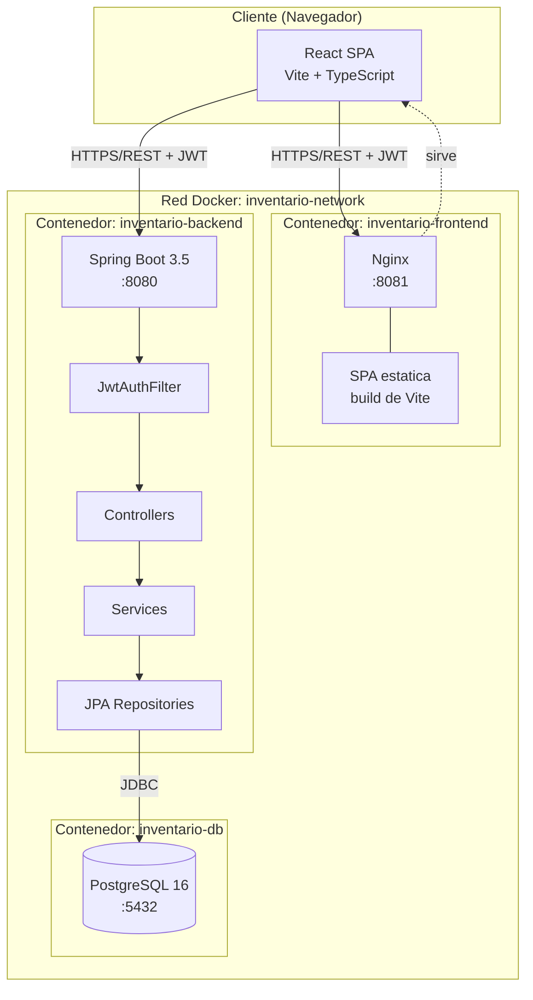

> **[Figura 3.1: Diagrama de componentes del sistema]**

### 3.2 Vista en capas

```
+-----------------------------------------------------------+
|                    PRESENTACION                            |
|   React 18 + TypeScript + Tailwind + shadcn/ui            |
|   - Componentes feature-first                             |
|   - TanStack Query (server state)                         |
|   - Zustand (client state: carrito, auth)                 |
+-----------------------------------------------------------+
                           |
                           | HTTP REST + JWT (axios)
                           v
+-----------------------------------------------------------+
|                    APLICACION                              |
|   Spring Boot 3.5                                         |
|   Controllers (REST)  ->  Services (logica)               |
|                            |                              |
|                            v                              |
|                       JPA Repositories                    |
+-----------------------------------------------------------+
                           |
                           | JDBC + Hibernate
                           v
+-----------------------------------------------------------+
|                    PERSISTENCIA                            |
|   PostgreSQL 16                                           |
|   - 10 tablas relacionales                                |
|   - Constraints de integridad referencial                 |
|   - Indice unico parcial (arqueo abierto por usuario)     |
+-----------------------------------------------------------+
```

> **[Figura 3.2: Arquitectura en capas]**

### 3.3 Flujo de una peticion tipica

1. El navegador envia `GET /api/productos` con el header `Authorization: Bearer <token>`.
2. Nginx (en el contenedor frontend) sirve la SPA. La SPA hace la peticion al backend en `http://localhost:8080/api/productos`.
3. `JwtAuthenticationFilter` intercepta la peticion, extrae el JWT, lo valida y carga el usuario con sus permisos.
4. Spring Security verifica que el endpoint permita el rol/autoridad del usuario via `@PreAuthorize`.
5. `ProductoController` delega al `ProductoService`.
6. El servicio consulta la BD via `ProductoRepository` (Spring Data JPA → Hibernate → JDBC → PostgreSQL).
7. La respuesta viaja de vuelta como JSON.
8. TanStack Query en el frontend cachea el resultado y re-renderiza los componentes.

### 3.4 Stack tecnologico completo

| Capa | Tecnologia | Version | Proposito |
|------|-----------|---------|-----------|
| Frontend SPA | React | 18 | Renderizado declarativo y reactivo |
| Frontend lenguaje | TypeScript | 5.6 | Tipado estatico |
| Frontend bundler | Vite | 6 | Dev server + build de produccion |
| Frontend estilos | Tailwind CSS | 3.4 | Utility-first CSS |
| Frontend UI | shadcn/ui (Radix) | varios | Componentes accesibles |
| Frontend estado | TanStack Query | 5 | Server state |
| Frontend estado | Zustand | 5 | Client state |
| Frontend graficas | Recharts | latest | Visualizacion |
| Frontend HTTP | Axios | 1.7 | Cliente HTTP con interceptores |
| Backend framework | Spring Boot | 3.5 | Aplicacion web |
| Backend lenguaje | Java | 17 | Lenguaje JVM moderno |
| Backend ORM | Hibernate (JPA) | 6 | Mapeo objeto-relacional |
| Backend seguridad | Spring Security | 6 | Autenticacion y autorizacion |
| Backend JWT | jjwt | 0.11 | Generacion y firma de tokens |
| Backend docs | springdoc-openapi | 2 | Swagger UI |
| Base de datos | PostgreSQL | 16 | RDBMS |
| Servidor web | Nginx | latest | Servir SPA estatica |
| Contenedores | Docker + Docker Compose | 24+ | Empaquetado y orquestacion |

---

## 4. Capa de Base de Datos

### 4.1 Motor y configuracion

- **PostgreSQL 16** corriendo en contenedor Docker (volumen persistente `postgres_data`)
- Puerto externo `7000`, interno `5432`
- Hibernate con `ddl-auto=update`: crea o modifica tablas automaticamente al arrancar el backend segun las entidades JPA
- Todas las columnas `id` son `bigint GENERATED BY DEFAULT AS IDENTITY` (autoincrement seguro, equivalente a `Long` en Java)
- Constraints de FK con `ON DELETE` por defecto (RESTRICT) para garantizar integridad

### 4.2 Diagrama Entidad-Relacion

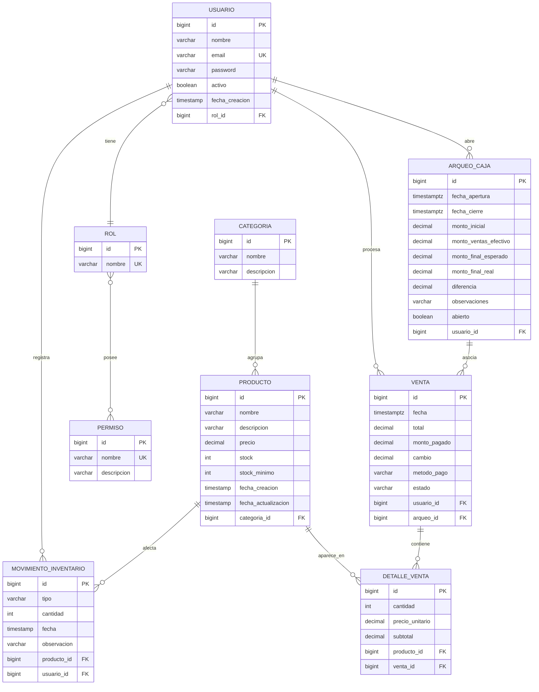

> **[Figura 4.1: Diagrama Entidad-Relacion]**

### 4.3 Tablas principales

#### `usuario`
Almacena las cuentas de acceso. Contrasenas hasheadas con BCrypt. La columna `rol_id` apunta a `rol`.

| Campo | Tipo | Restriccion |
|-------|------|-------------|
| id | bigint | PK, IDENTITY |
| nombre | varchar(100) | NOT NULL |
| email | varchar(150) | NOT NULL, UNIQUE |
| password | varchar(255) | NOT NULL (bcrypt hash) |
| activo | boolean | NOT NULL, DEFAULT true |
| fecha_creacion | timestamp | NOT NULL |
| rol_id | bigint | NOT NULL, FK rol(id) |

#### `rol`, `permiso`, `rol_permiso`
Sistema de permisos N:N. Cada rol tiene un conjunto de permisos seleccionables.

```
rol(id, nombre [ADMIN|EMPLEADO])
permiso(id, nombre, descripcion)
rol_permiso(rol_id, permiso_id)
```

Permisos disponibles en el enum `NombrePermiso`:
- `PRODUCTOS_CREAR`, `PRODUCTOS_EDITAR`, `PRODUCTOS_ELIMINAR`
- `CATEGORIAS_GESTIONAR`
- `MOVIMIENTOS_CREAR`
- `VENTAS_ANULAR`
- `REPORTES_VER`
- `USUARIOS_GESTIONAR`

#### `categoria` y `producto`
| `categoria` | Tipo | Restriccion |
|-------------|------|-------------|
| id | bigint | PK |
| nombre | varchar | NOT NULL |
| descripcion | varchar | nullable |

| `producto` | Tipo | Restriccion |
|------------|------|-------------|
| id | bigint | PK, IDENTITY |
| nombre | varchar(150) | NOT NULL |
| descripcion | varchar(500) | nullable |
| precio | numeric(10,2) | NOT NULL |
| stock | int | NOT NULL, DEFAULT 0 |
| stock_minimo | int | NOT NULL, DEFAULT 0 |
| fecha_creacion | timestamp | NOT NULL |
| fecha_actualizacion | timestamp | nullable |
| categoria_id | bigint | NOT NULL, FK |

El metodo `Producto.isStockBajo()` retorna `stock <= stockMinimo`. Es la base del modulo de alertas.

#### `movimiento_inventario`
Registro **inmutable** de cada cambio de stock (no se editan ni borran).

| Campo | Tipo | Notas |
|-------|------|-------|
| id | bigint | PK |
| tipo | varchar | ENTRADA o SALIDA |
| cantidad | int | NOT NULL > 0 |
| fecha | timestamp | NOT NULL |
| observacion | varchar | "Venta #N", "Anulacion Venta #N", "Reabastecimiento mensual", etc. |
| producto_id | bigint | FK |
| usuario_id | bigint | FK |

Cada venta genera N movimientos `SALIDA`. Cada anulacion genera N movimientos `ENTRADA`.

#### `venta` y `detalle_venta`
| `venta` | Tipo | Notas |
|---------|------|-------|
| id | bigint | PK |
| fecha | timestamptz | DEFAULT now() |
| total | numeric(12,2) | NOT NULL |
| monto_pagado | numeric(12,2) | NOT NULL |
| cambio | numeric(12,2) | NOT NULL |
| metodo_pago | varchar(50) | EFECTIVO/TARJETA/TRANSFERENCIA |
| estado | varchar(20) | COMPLETADA/ANULADA |
| usuario_id | bigint | FK |
| arqueo_id | bigint | FK nullable |

| `detalle_venta` | Tipo | Notas |
|-----------------|------|-------|
| id | bigint | PK |
| cantidad | int | NOT NULL |
| precio_unitario | numeric(12,2) | NOT NULL (precio en el momento de la venta) |
| subtotal | numeric(12,2) | nullable (calculable) |
| producto_id | bigint | FK |
| venta_id | bigint | FK |

`precio_unitario` se guarda explicitamente porque el precio del producto puede cambiar en el futuro y queremos conservar el historico.

#### `arqueo_caja`
| Campo | Tipo | Notas |
|-------|------|-------|
| id | bigint | PK |
| fecha_apertura | timestamptz | DEFAULT now() |
| fecha_cierre | timestamptz | nullable |
| monto_inicial | numeric(12,2) | NOT NULL |
| monto_ventas_efectivo | numeric(12,2) | acumula solo ventas EFECTIVO |
| monto_final_esperado | numeric(12,2) | = monto_inicial + monto_ventas_efectivo |
| monto_final_real | numeric(12,2) | nullable hasta el cierre |
| diferencia | numeric(12,2) | = monto_final_real - monto_final_esperado |
| observaciones | text | nullable |
| abierto | boolean | NOT NULL |
| usuario_id | bigint | FK |

**Constraint critico:** un indice unico parcial garantiza que un usuario no tenga mas de un arqueo abierto simultaneamente.

```sql
CREATE UNIQUE INDEX uniq_arqueo_abierto_por_usuario
  ON arqueo_caja (usuario_id) WHERE abierto = true;
```

Esto se hace **a nivel de base de datos** (no solo en el servicio) para que aunque haya condiciones de carrera (dos requests simultaneos), la BD rechace la segunda insercion.

### 4.4 Indices de rendimiento

```sql
CREATE INDEX idx_venta_fecha ON venta(fecha DESC);
CREATE INDEX idx_venta_arqueo ON venta(arqueo_id);
CREATE INDEX idx_detalle_venta_venta ON detalle_venta(venta_id);
```

Estos indices aceleran las consultas mas frecuentes:
- Listar las ventas mas recientes (para el historial).
- Filtrar las ventas asociadas a un arqueo (para calcular el detalle).
- Cargar todos los detalles de una venta (al expandir una fila o al anular).

---

## 5. Capa Backend (Spring Boot)

### 5.1 Diagrama de clases (entidades JPA)

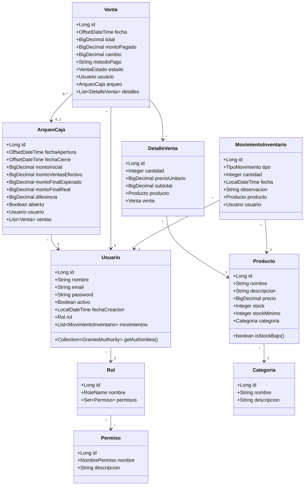

> **[Figura 5.1: Diagrama de clases del backend]**

### 5.2 Estructura de paquetes

```
EntornosProgramacion.SistemaInventario/
+-- SistemaInventarioApplication.java   (@SpringBootApplication, @EnableScheduling)
+-- config/
|   +-- DataInitializer.java            (siembra roles, permisos, admin al arrancar)
|   +-- SecurityConfig.java             (JWT, CORS, reglas de acceso, BCrypt)
|   +-- OpenApiConfig.java              (Swagger/OpenAPI)
+-- model/
|   +-- (10 entidades + 4 enums)
+-- repository/                         (interfaces Spring Data JPA)
+-- service/                            (logica de negocio - @Service @Transactional)
+-- controller/                         (REST endpoints - @RestController)
+-- dto/
|   +-- request/                        (records inmutables de entrada)
|   +-- response/                       (records inmutables de salida)
+-- security/
|   +-- JwtAuthenticationFilter.java    (filtro de cada request)
|   +-- JwtService.java                 (genera y valida tokens)
|   +-- CustomUserDetailsService.java   (carga usuario + rol + permisos)
+-- exception/
    +-- (excepciones de dominio)
    +-- GlobalExceptionHandler.java     (@RestControllerAdvice)
```

### 5.3 Autenticacion JWT

#### Diagrama de secuencia — Login

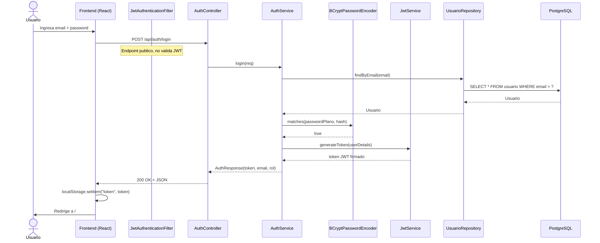

> **[Figura 5.2: Secuencia de inicio de sesion]**

#### Diagrama de secuencia — Peticion autenticada

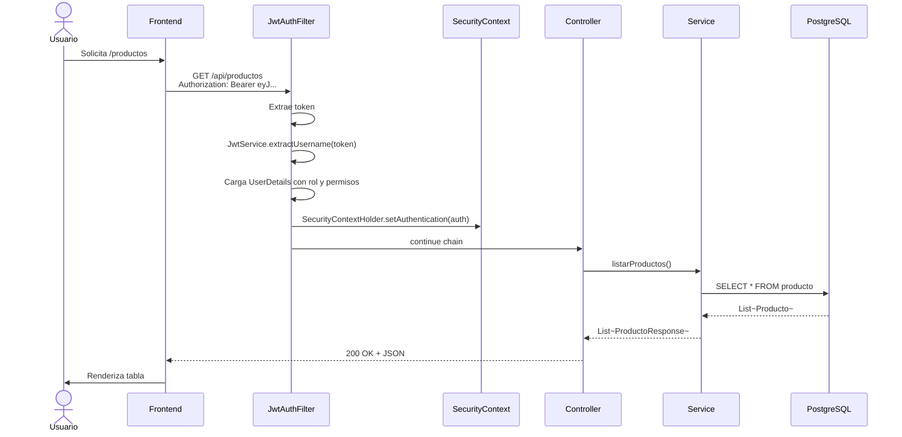

> **[Figura 5.3: Secuencia de peticion autenticada]**

### 5.4 Sistema de permisos

`Usuario.getAuthorities()` retorna tanto el rol como cada permiso individual:

```java
List<GrantedAuthority> authorities = new ArrayList<>();
authorities.add(new SimpleGrantedAuthority("ROLE_" + rol.getNombre().name()));
for (Permiso permiso : rol.getPermisos()) {
    authorities.add(new SimpleGrantedAuthority(permiso.getNombre().name()));
}
return authorities;
```

Esto permite usar las dos formas de proteccion en los endpoints:

```java
@PreAuthorize("hasRole('ADMIN')")                          // por rol
@PreAuthorize("hasAuthority('VENTAS_ANULAR')")             // por permiso
@PreAuthorize("hasRole('ADMIN') or hasAuthority('VENTAS_ANULAR')")  // combinado
```

**Importante:** los permisos del rol se cargan EAGER (`@ManyToMany(fetch = FetchType.EAGER)`) para evitar `LazyInitializationException` cuando Spring Security llama a `getAuthorities()` fuera del contexto de la sesion JPA.

### 5.5 Transaccionalidad

Todos los metodos de servicio que modifican datos estan anotados con `@Transactional`. Spring crea una transaccion por metodo, y si se lanza cualquier `RuntimeException` (incluyendo `StockInsuficienteException`), todo el cambio se revierte (rollback automatico).

Esto es critico en `procesarVenta`: si la creacion del primer movimiento falla, no quedan ventas a medio guardar ni stocks alterados parcialmente.

### 5.6 Servicios clave

#### 5.6.1 `VentaService.procesarVenta()`

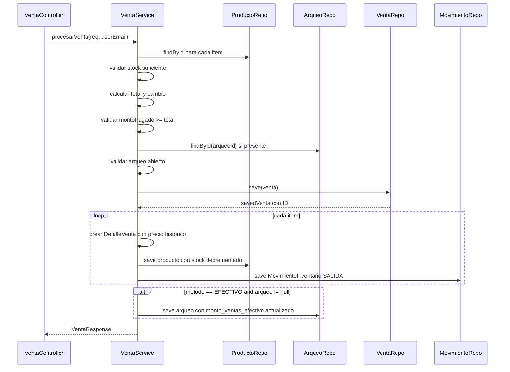

> **[Figura 5.4: Secuencia de procesamiento de venta]**

#### 5.6.2 `VentaService.anularVenta()`

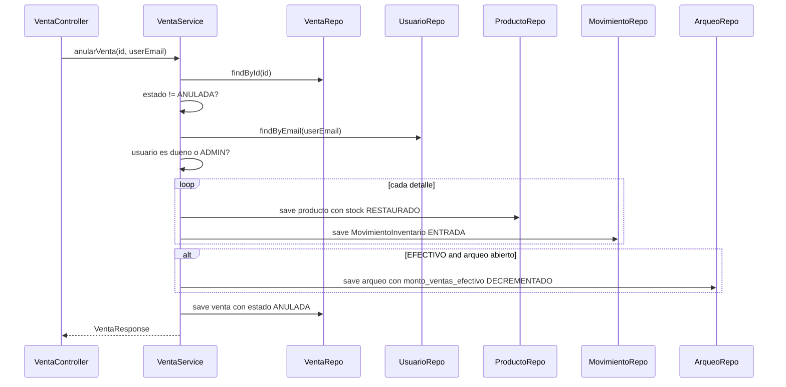

> **[Figura 5.5: Secuencia de anulacion de venta]**

#### 5.6.3 `ArqueoCajaService`

- `abrirArqueo()`: Verifica que no haya otro arqueo abierto del usuario (el constraint unico en BD tambien lo garantiza). Inicializa `montoVentasEfectivo = 0` explicitamente.
- `cerrarArqueo()`: Verifica que el usuario sea el dueno o ADMIN. Calcula `diferencia = montoFinalReal - montoFinalEsperado`.

#### 5.6.4 `ReporteService.obtenerResumen()`

Calcula todos los KPIs del dashboard en una sola llamada:
- Ventas hoy, esta semana, este mes (filtrando solo ventas COMPLETADAS).
- Ventas de los ultimos 7 dias agrupadas por dia para la grafica de barras.
- Top 5 productos por unidades vendidas en el mes.
- Diferencia promedio de los arqueos cerrados este mes.
- Ingresos por metodo de pago del mes.

#### 5.6.5 `StockAlertService`

Tarea programada con cron `0 0 8 * * MON-SAT` (cada dia laboral a las 8 AM). Consulta todos los productos con `stock <= stock_minimo` y los registra en el log del servidor con nivel WARN.

```java
@Scheduled(cron = "0 0 8 * * MON-SAT")
public void verificarStockBajo() {
    List<Producto> bajos = productoRepository.findStockBajo();
    if (bajos.isEmpty()) return;
    log.warn("===== ALERTA STOCK BAJO: {} producto(s) =====", bajos.size());
    bajos.forEach(p -> log.warn(...));
}
```

### 5.7 Manejo de errores

El `GlobalExceptionHandler` centraliza todas las excepciones y las convierte en respuestas HTTP estandarizadas:

| Excepcion | HTTP Status | Uso |
|-----------|-------------|-----|
| `ResourceNotFoundException` | 404 | Producto, venta o usuario no encontrado |
| `BusinessException`, `IllegalArgumentException`, `IllegalStateException` | 400 | Errores de logica (stock insuficiente, monto insuficiente, arqueo cerrado, etc.) |
| `EmailAlreadyExistsException` | 409 | Email duplicado al crear usuario |
| `DataIntegrityViolationException` | 409 | Violacion de FK o UNIQUE |
| `MethodArgumentNotValidException` | 400 | Bean Validation (`@NotNull`, `@Min`, etc.) |
| `AccessDeniedException` | 403 | Sin permiso para la operacion |
| `BadCredentialsException` | 401 | Credenciales incorrectas |
| `DisabledException` | 401 | Cuenta desactivada |
| `Exception` (generico) | 500 | Error no controlado, se loguea con stack trace |

Todas las respuestas de error tienen el mismo formato:

```json
{
  "timestamp": "2026-05-08T10:30:45",
  "status": 400,
  "error": "Bad Request",
  "message": "Stock insuficiente para: Audifonos Bluetooth (disponible: 0, solicitado: 1)",
  "path": "/api/ventas"
}
```

---

## 6. Capa Frontend (React + TypeScript)

### 6.1 Arquitectura feature-first

Cada modulo funcional vive en su propia carpeta bajo `src/features/`:

```
features/
+-- auth/
|   +-- api/auth-api.ts                 -- POST /api/auth/login
|   +-- components/login-page.tsx       -- Formulario de login
|   +-- store.ts                        -- Zustand: token, user, login(), logout()
+-- productos/
|   +-- api/productos-api.ts
|   +-- components/                     -- Tabla CRUD + dialogo de formulario
+-- categorias/
+-- movimientos/
|   +-- components/                     -- Tabla con filtros y exportacion CSV
+-- carrito/
|   +-- store.ts                        -- Zustand: items[], addItem, removeItem, total
|   +-- components/carrito-page.tsx     -- POS con catalogo + carrito + dialogo
+-- arqueo/
|   +-- api/arqueo-api.ts
|   +-- components/                     -- Panel abierto/cerrado + historial
+-- ventas/
|   +-- api/ventas-api.ts
|   +-- components/                     -- Historial con anulacion
+-- dashboard/
|   +-- api/dashboard-api.ts
|   +-- components/                     -- KPIs + graficas (Recharts)
+-- permisos/
    +-- api/permisos-api.ts
    +-- components/                     -- Toggles por rol
```

### 6.2 Estado del servidor con TanStack Query

Cada peticion al backend se define como una `queryKey` unica:

| queryKey | Endpoint | Donde se usa |
|----------|----------|--------------|
| `["productos"]` | GET /api/productos | Catalogo, dashboard, carrito |
| `["productos", "stock-bajo"]` | GET /api/productos/stock-bajo | Banner, badge, dashboard |
| `["categorias"]` | GET /api/categorias | Catalogo, formularios |
| `["movimientos"]` | GET /api/movimientos | Pagina de movimientos |
| `["ventas"]` | GET /api/ventas | Historial, dashboard |
| `["arqueo", "abierto"]` | GET /api/arqueos/abierto | Carrito (badge) y arqueo |
| `["arqueo", "todos"]` | GET /api/arqueos | Historial colapsable |
| `["reportes", "resumen"]` | GET /api/reportes/resumen | Dashboard |
| `["permisos", "roles"]` | GET /api/permisos/roles | Pagina permisos |
| `["permisos", "todos"]` | GET /api/permisos | Pagina permisos |

**Configuracion global:**
- `staleTime: 30_000` (30 segundos antes de considerar datos obsoletos)
- `retry: 1` (un solo reintento en caso de fallo)
- `refetchOnWindowFocus: false` (no recarga al volver a la pestana)

Cuando una mutacion tiene exito, invalida las queries relevantes con `queryClient.invalidateQueries()` para forzar una recarga.

### 6.3 Estado local con Zustand

**`useCartStore`** maneja el carrito de compras en memoria:

```typescript
interface CartState {
  items: CartItem[]
  addItem: (producto: Producto) => void
  removeItem: (productoId: number) => void
  updateCantidad: (productoId: number, cant: number) => void
  clearCart: () => void
  total: () => number
}
```

Al confirmar la venta, el carrito se limpia con `clearCart()`. El store persiste entre navegaciones sin recargar la pagina pero se pierde si el usuario recarga el navegador (comportamiento intencional para un POS).

**`useAuthStore`** guarda el token JWT y los datos del usuario en `localStorage`:

```typescript
interface AuthState {
  token: string | null
  user: AuthUser | null
  isAuthenticated: boolean
  login: (token, user) => void
  logout: () => void
}
```

### 6.4 Navegacion y guards

El router de React Router tiene tres niveles de proteccion:

1. **`PublicOnlyRoute`**: redirige a `/` si ya esta autenticado (para `/login`)
2. **`PrivateRoute`**: redirige a `/login` si no esta autenticado
3. **`RoleRoute`**: redirige a `/` si el usuario no tiene el rol requerido (usado para `/usuarios` y `/permisos`)

```
App
+-- /login (PublicOnly)
+-- /* (Private + AppLayout)
    +-- /
    +-- /productos
    +-- /categorias
    +-- /movimientos
    +-- /carrito
    +-- /arqueo
    +-- /ventas
    +-- (RoleRoute ADMIN)
        +-- /usuarios
        +-- /permisos
```

### 6.5 Componentes de layout

**`AppLayout`** envuelve todas las paginas autenticadas. Consulta `GET /api/productos/stock-bajo` cada 5 minutos y muestra un banner naranja si hay productos criticos.

**`Sidebar`** muestra los links de navegacion. Si hay productos con stock bajo, el link "Productos" muestra un badge rojo con el conteo.

**`Topbar`** barra superior con nombre del usuario y boton de logout.

### 6.6 Cliente HTTP (Axios)

`shared/api/client.ts` configura una instancia de Axios con:

- **`baseURL`**: `VITE_API_URL/api` (configurable por variable de entorno)
- **Request interceptor:** lee el token de `localStorage` y lo agrega al header `Authorization: Bearer <token>` en cada peticion
- **Response interceptor:** si la respuesta es 401, hace logout automatico y redirige al login

---

## 7. Flujos de negocio completos

### 7.1 Flujo: Procesar una venta en efectivo

#### Diagrama de secuencia detallado

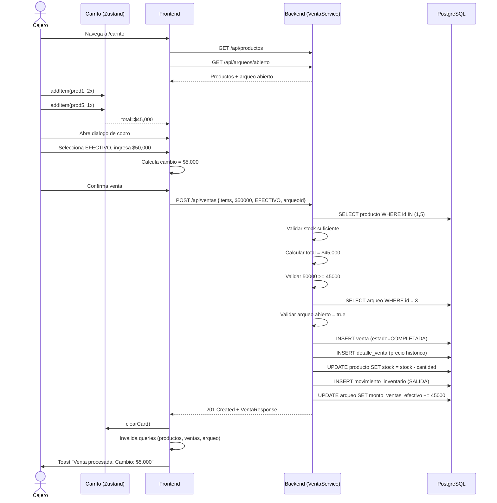

> **[Figura 7.1: Secuencia de procesamiento de venta]**

#### Resumen narrativo

```
Cajero navega a /carrito
    -> useQuery carga productos y arqueo abierto
    -> Cajero agrega 2 productos al carrito (useCartStore)
    -> Carrito muestra total: $45,000
    -> Cajero abre dialogo de confirmacion
    -> Selecciona metodo: EFECTIVO
    -> Ingresa monto recibido: $50,000
    -> Sistema muestra cambio: $5,000
    -> Cajero confirma

Backend (VentaService.procesarVenta) — ATOMICO:
1. Valida stock de cada item (antes de modificar nada)
2. Calcula total = $45,000
3. Verifica cambio = 50,000 - 45,000 = 5,000 >= 0 -> OK
4. Verifica arqueo 3 esta abierto -> OK
5. Guarda venta (id=9, estado=COMPLETADA)
6. Crea DetalleVenta con precio historico de cada producto
7. Decrementa stock y guarda MovimientoInventario SALIDA
8. Arqueo: monto_ventas_efectivo += 45,000

Frontend:
-> Toast: "Venta procesada. Cambio: $5,000"
-> Limpia carrito
-> Invalida queries: productos, arqueo abierto, ventas
```

### 7.2 Flujo: Cuadre de caja al cerrar turno

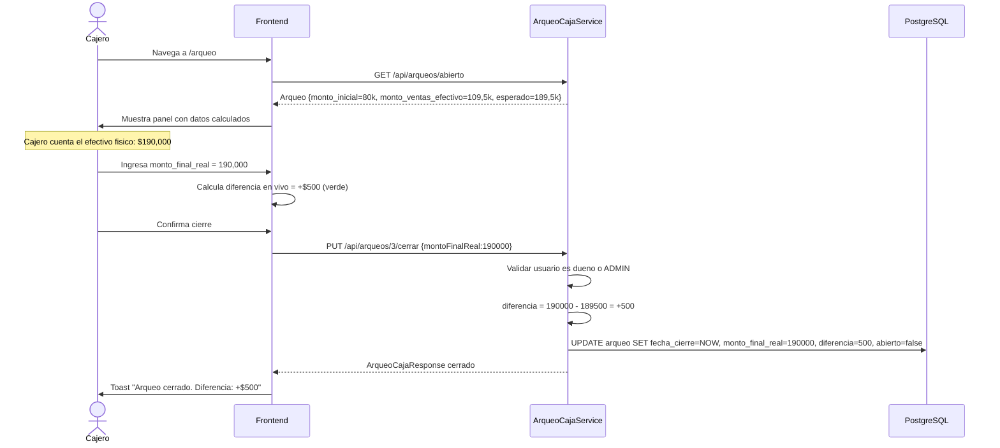

> **[Figura 7.2: Secuencia de cuadre de caja]**

### 7.3 Flujo: Anular una venta

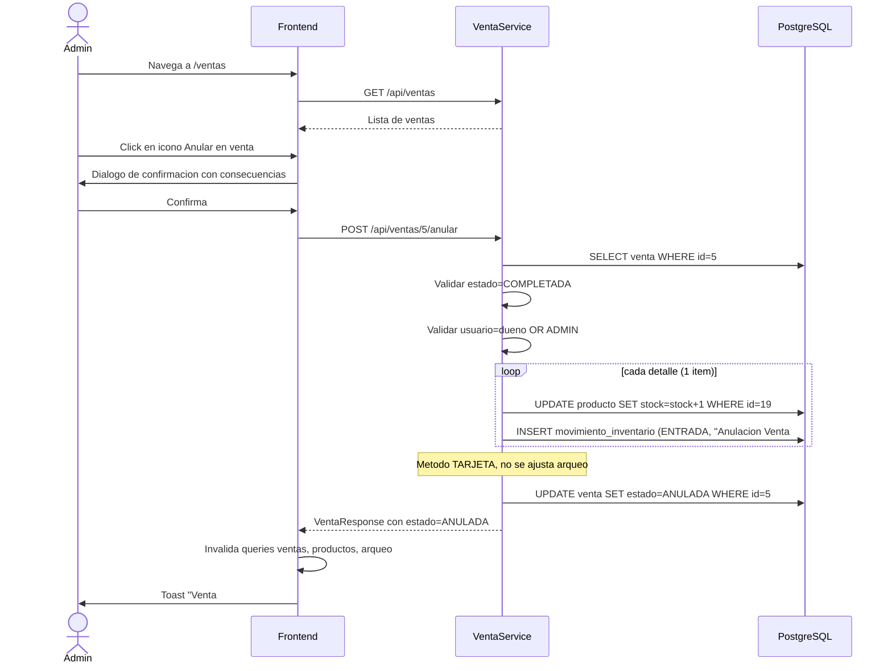

> **[Figura 7.3: Secuencia de anulacion de venta]**

### 7.4 Flujo: Configurar permisos del rol Empleado

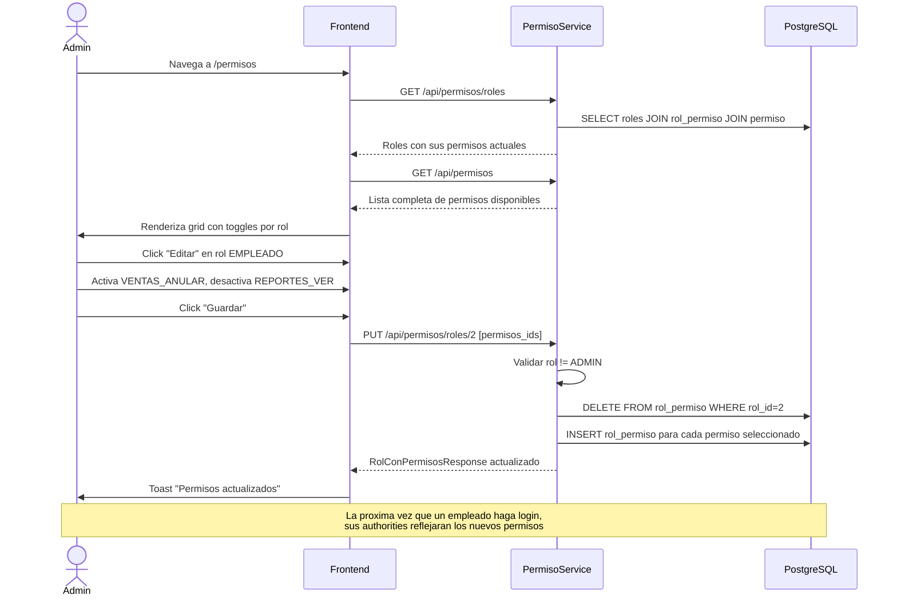

> **[Figura 7.4: Secuencia de configuracion de permisos]**

---

## 8. Despliegue con Docker

### 8.1 Arquitectura de contenedores

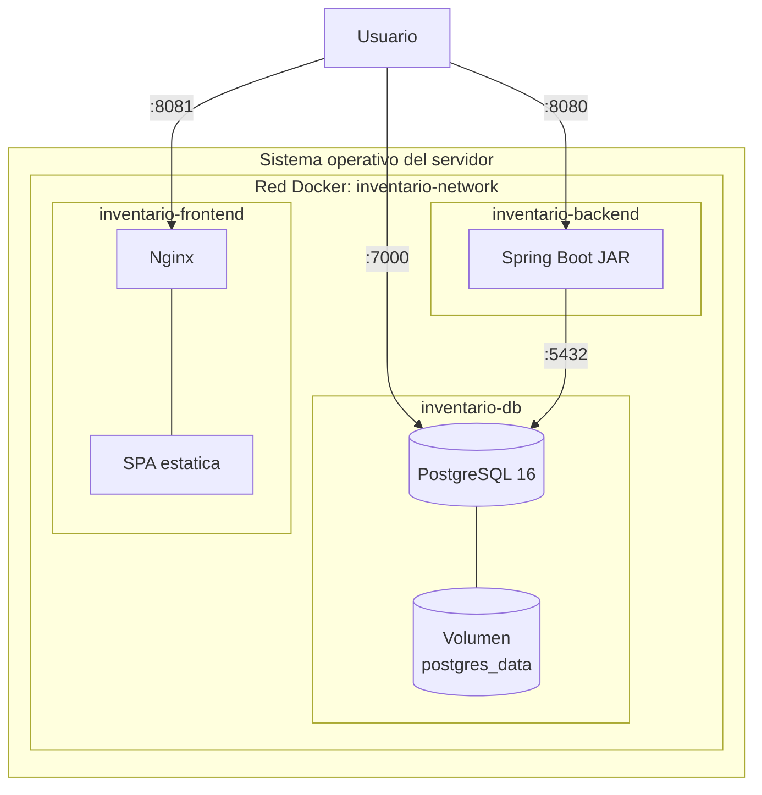

> **[Figura 8.1: Arquitectura de contenedores Docker]**

### 8.2 Servicios definidos en `docker-compose.yml`

#### `db` (PostgreSQL 16)
- Imagen: `postgres:16`
- Puerto: `7000:5432`
- Volumen persistente `postgres_data` para que los datos sobrevivan entre reinicios
- Healthcheck con `pg_isready` cada 10 segundos

#### `backend` (Spring Boot)
- Imagen construida desde `dockerfile` con Maven
- Lee variables de entorno del archivo `.env`
- `depends_on: db: condition: service_healthy` (no arranca hasta que la BD este lista)
- Puerto: `8080:8080`
- `restart: unless-stopped`

#### `frontend` (Nginx + React)
- Imagen construida desde `Dockerfile.frontend`:
  1. Etapa 1 (build): Node 18 + `npm install` + `npm run build`
  2. Etapa 2 (runtime): Nginx alpine sirviendo el `dist/`
- Variable `VITE_API_URL=http://localhost:8080` se inyecta en build time
- Puerto: `8081:8081`
- `depends_on: backend` (simple, sin healthcheck)

Todos los servicios estan en la red `inventario-network` para comunicarse por nombre de contenedor (ej: el backend usa `db` como hostname para conectarse a PostgreSQL).

### 8.3 Estrategia de inicializacion

1. Docker arranca `inventario-db` primero.
2. PostgreSQL inicializa la BD `sistema_inventario` (si es la primera vez) y queda listo en pocos segundos.
3. El healthcheck (`pg_isready`) marca el contenedor como `(healthy)`.
4. Docker arranca `inventario-backend`, que ya puede conectarse.
5. Hibernate ejecuta `ddl-auto=update`: crea las tablas si no existen, agrega columnas nuevas si la entidad tiene campos nuevos.
6. `DataInitializer` siembra roles, permisos y el usuario admin si no existen.
7. Docker arranca `inventario-frontend`, que sirve la SPA por Nginx.

---

## 9. Decisiones de diseno

### 9.1 Por que `Long` y no `Integer` para los IDs

PostgreSQL usa `bigint` para todas las secuencias por defecto cuando Hibernate crea las tablas con `GenerationType.IDENTITY`. Si el codigo Java usa `Integer`, hay una desalineacion de tipos que puede causar errores en operaciones JPA. Se uso `Long` en todas las entidades para ser consistente con el esquema real de la BD y evitar overflow despues de 2 mil millones de registros.

### 9.2 Por que guardar el `precio_unitario` en `detalle_venta`

El precio de un producto puede cambiar en el futuro. Si solo guardaramos el `productoId`, perderiamos la informacion de cuanto costaba cuando se hizo la venta. Guardando `precioUnitario` en cada detalle, el historial de ventas siempre es preciso y los reportes financieros consistentes.

### 9.3 Por que EFECTIVO no afecta el arqueo cuando se usa TARJETA

El arqueo de caja representa el efectivo fisico que debe haber en la caja registradora. Los pagos con tarjeta van directo al banco, no a la caja. Sumar esas ventas al arqueo daria una diferencia falsa al cerrar el turno.

### 9.4 Por que los permisos se cargan EAGER

Spring Security necesita conocer todos los permisos del usuario en el momento de la autenticacion, antes de llegar a cualquier endpoint. Cargar permisos de forma lazy causaria `LazyInitializationException` fuera de una sesion de JPA. Con `FetchType.EAGER` en `Rol.permisos`, todo se carga en un solo JOIN al validar el JWT (impacto despreciable porque hay maximo ~10 permisos por rol).

### 9.5 Por que usar records de Java para los DTOs

Los records son inmutables, tienen constructor, getters, equals/hashCode y toString generados automaticamente. Para DTOs que solo transfieren datos (sin comportamiento), son perfectos y mas concisos que las clases tradicionales con Lombok. Ademas previenen mutaciones accidentales en los handlers.

### 9.6 Por que el JWT no incluye los permisos

Inicialmente se considero meter los permisos como claim en el JWT. Se descarto porque:
1. Los permisos pueden cambiar en cualquier momento (el ADMIN edita el rol EMPLEADO).
2. Si los metimos en el token, los cambios solo aplicarian al siguiente login.
3. Cargarlos desde la BD en cada peticion tiene impacto despreciable (un JOIN simple, ~5 ms).

Por eso los permisos se cargan **siempre** desde la BD al validar el token (`CustomUserDetailsService.loadUserByUsername()`).

### 9.7 Por que Zustand para el carrito y no React Context

React Context produce re-renders en todos los consumidores cada vez que el estado cambia. Para un carrito con 20 items que se actualiza 30 veces por venta, esto seria muy ineficiente. Zustand permite suscribirse a slices especificos del estado, por lo que solo se re-renderiza el componente que realmente cambio.

### 9.8 Por que un endpoint unico de resumen

`GET /api/reportes/resumen` retorna **todos** los KPIs del dashboard en un solo JSON. La alternativa seria 5-6 endpoints separados (ventas hoy, ventas semana, top productos, etc.) pero entonces el dashboard haria 5-6 peticiones HTTP en paralelo. Una sola peticion con un JSON mas grande es mas eficiente y simplifica el manejo de errores.

### 9.9 Por que recharts y no chart.js

Recharts es declarativo (usa JSX) y se integra naturalmente con React. Chart.js requiere refs y manipulacion imperativa. Recharts tambien tiene mejor soporte de TypeScript out-of-the-box.

### 9.10 Por que `staleTime: 30s` en TanStack Query

Balance entre frescura de datos y peticiones innecesarias. 30 segundos es suficiente para que el usuario perciba el sistema como "instantaneo" pero evita disparar peticiones identicas cada vez que un componente se monta. Para datos criticos (como el arqueo abierto en el carrito), se usan `refetchInterval` mas agresivos.

---

## 10. Endpoints completos de la API

| Metodo | Endpoint | Acceso | Descripcion |
|--------|----------|--------|-------------|
| POST | /api/auth/login | Publico | Autenticar usuario y obtener JWT |
| GET | /api/productos | Autenticado | Listar todos los productos |
| GET | /api/productos/stock-bajo | Autenticado | Productos con stock <= stock_minimo |
| GET | /api/productos/{id} | Autenticado | Detalle de un producto |
| POST | /api/productos | ADMIN / PRODUCTOS_CREAR | Crear producto |
| PUT | /api/productos/{id} | ADMIN / PRODUCTOS_EDITAR | Actualizar producto |
| DELETE | /api/productos/{id} | ADMIN / PRODUCTOS_ELIMINAR | Eliminar producto |
| GET | /api/categorias | Autenticado | Listar categorias |
| POST | /api/categorias | ADMIN / CATEGORIAS_GESTIONAR | Crear categoria |
| PUT | /api/categorias/{id} | ADMIN / CATEGORIAS_GESTIONAR | Actualizar categoria |
| DELETE | /api/categorias/{id} | ADMIN / CATEGORIAS_GESTIONAR | Eliminar categoria |
| GET | /api/movimientos | Autenticado | Listar movimientos de inventario |
| POST | /api/movimientos | Autenticado | Registrar movimiento manual |
| POST | /api/ventas | Autenticado | Procesar nueva venta |
| GET | /api/ventas | Autenticado | Historial de ventas |
| GET | /api/ventas/{id} | Autenticado | Detalle de una venta |
| POST | /api/ventas/{id}/anular | ADMIN / VENTAS_ANULAR | Anular una venta |
| POST | /api/arqueos/abrir | Autenticado | Abrir sesion de caja |
| PUT | /api/arqueos/{id}/cerrar | Dueno / ADMIN | Cerrar sesion de caja |
| GET | /api/arqueos/abierto | Autenticado | Sesion activa del usuario |
| GET | /api/arqueos | Autenticado | Historial de arqueos |
| GET | /api/arqueos/{id} | Autenticado | Detalle de un arqueo |
| GET | /api/reportes/resumen | ADMIN / REPORTES_VER | KPIs del dashboard |
| GET | /api/permisos/roles | ADMIN | Roles con sus permisos |
| GET | /api/permisos | ADMIN | Lista completa de permisos |
| PUT | /api/permisos/roles/{rolId} | ADMIN | Actualizar permisos de un rol |
| GET | /api/usuarios | ADMIN | Listar usuarios |
| POST | /api/usuarios | ADMIN | Crear usuario |
| PUT | /api/usuarios/{id} | ADMIN | Actualizar usuario |
| DELETE | /api/usuarios/{id} | ADMIN | Desactivar usuario |
| POST | /api/usuarios/{id}/cambiar-password | Dueno / ADMIN | Cambiar contrasena |

La documentacion interactiva completa con ejemplos de request/response esta en `http://localhost:8080/swagger-ui.html`.

---

## 11. Capturas del sistema

> Esta seccion contiene los placeholders de las capturas que se incluiran en el informe final. Cada placeholder describe la pantalla y los elementos que deben ser visibles. Reemplazar cada bloque con la imagen correspondiente al exportar a PDF.

### 11.1 Pantalla de Login

> **[Figura 11.1: Pantalla de inicio de sesion]**  
> Mostrar: formulario centrado con campos email + contrasena, boton "Iniciar sesion", logo del sistema. Capturar despues de un intento de login fallido para mostrar el mensaje de error.

### 11.2 Dashboard

> **[Figura 11.2: Dashboard con KPIs]**  
> Mostrar: las cuatro tarjetas de KPIs (Ventas Hoy, Esta Semana, Este Mes, Alertas Stock), la grafica de barras de los ultimos 7 dias, la grafica de pastel de ingresos por metodo de pago, la tabla de top productos del mes y la tabla de productos con stock bajo. Asegurarse de que haya datos visibles (cargar el seed-data.sql antes).

### 11.3 Banner de stock bajo

> **[Figura 11.3: Banner persistente y badge en sidebar]**  
> Captura tipo "zoom" del banner naranja con mensaje "X producto(s) con stock bajo el minimo: ..." y del sidebar mostrando el badge rojo con el numero junto al link "Productos".

### 11.4 Listado de Productos

> **[Figura 11.4: Pagina de Productos]**  
> Mostrar: tabla con columnas Nombre, Categoria, Precio, Stock, Stock Minimo, Estado. Productos con stock bajo deben aparecer marcados visualmente. Boton "Agregar producto" en la esquina superior. Si el usuario es ADMIN, mostrar tambien botones de editar y eliminar.

### 11.5 Carrito / Punto de Venta

> **[Figura 11.5: Punto de Venta]**  
> Mostrar: catalogo a la izquierda con buscador y filtros, panel del carrito a la derecha con 2-3 items agregados, total visible. Boton "Procesar venta" habilitado.

### 11.6 Dialogo de cobro

> **[Figura 11.6: Dialogo de confirmacion de venta]**  
> Mostrar: dialogo con resumen de items, selector de metodo de pago (EFECTIVO seleccionado), campo de monto pagado con un valor mayor al total, linea de cambio calculada en tiempo real, boton "Confirmar". Bonus: capturar tambien el caso TRANSFERENCIA donde el campo de monto pagado esta deshabilitado.

### 11.7 Aviso sin arqueo

> **[Figura 11.7: Aviso de venta sin arqueo abierto]**  
> Banner amarillo en el carrito indicando "No hay arqueo de caja abierto. La venta no se asociara a ninguna sesion."

### 11.8 Arqueo de Caja — Abrir

> **[Figura 11.8: Formulario de apertura de arqueo]**  
> Cuando no hay arqueo abierto, mostrar el formulario con campo "Monto inicial", textarea de observaciones y boton "Abrir Caja".

### 11.9 Arqueo de Caja — Sesion activa

> **[Figura 11.9: Sesion activa con detalle]**  
> Tarjetas con monto inicial, ventas en efectivo acumuladas, monto esperado, hora de apertura. Tabla de detalle de ventas asociadas agrupadas por producto. Formulario de cierre con preview de la diferencia.

### 11.10 Arqueo de Caja — Historial colapsable

> **[Figura 11.10: Historial de arqueos cerrados]**  
> Tabla con todos los arqueos historicos: fecha apertura, fecha cierre, monto inicial, ventas, esperado, real, diferencia (con color), estado.

### 11.11 Historial de Ventas

> **[Figura 11.11: Pagina de historial de ventas]**  
> Tabla con todas las ventas, badge de estado (COMPLETADA verde, ANULADA rojo), columna Total, boton de anular en las que aplica. Una fila expandida mostrando los detalles de los productos vendidos.

### 11.12 Confirmacion de anulacion

> **[Figura 11.12: Dialogo de anulacion de venta]**  
> Dialogo con titulo "Confirmar Anulacion", lista con las consecuencias (restauracion de stock, ajuste de arqueo, irreversibilidad), boton rojo "Confirmar Anulacion".

### 11.13 Movimientos de Inventario

> **[Figura 11.13: Pagina de movimientos]**  
> Tabla con filtros (tipo, producto, fechas), tarjetas de resumen (entradas, salidas, total), boton "Exportar CSV", iconos de flecha verde/roja en la columna tipo.

### 11.14 Gestion de Usuarios (solo ADMIN)

> **[Figura 11.14: Tabla de usuarios]**  
> Tabla con columnas Nombre, Email, Rol, Activo, Fecha Creacion. Botones de editar, cambiar contrasena, desactivar. Boton "Crear usuario" en la esquina superior.

### 11.15 Gestion de Permisos (solo ADMIN)

> **[Figura 11.15: Pagina de permisos]**  
> Dos tarjetas (una por rol). En la del rol ADMIN: badge "Solo lectura", todos los permisos marcados, no editable. En la del rol EMPLEADO: en modo edicion, mostrando algunos permisos activos (azul) y otros inactivos (gris), botones "Cancelar" y "Guardar".

### 11.16 Swagger UI

> **[Figura 11.16: Documentacion API en Swagger]**  
> Vista de la documentacion interactiva con todos los endpoints listados, expandido `POST /api/ventas` mostrando el ejemplo del body request y los posibles responses.

### 11.17 Estructura del proyecto

> **[Figura 11.17: Estructura de carpetas]**  
> Captura de un IDE (IntelliJ/VS Code) mostrando la estructura del proyecto en el explorador, con la jerarquia completa de carpetas tanto del backend como del frontend.

### 11.18 Docker en ejecucion

> **[Figura 11.18: Output de `docker ps`]**  
> Captura de la terminal mostrando los tres contenedores corriendo con `docker ps`, indicando los puertos mapeados y el estado `healthy` en la BD.
